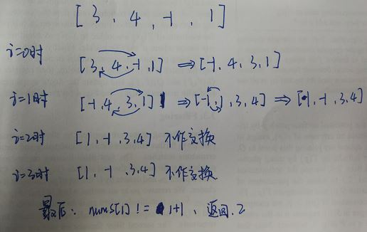
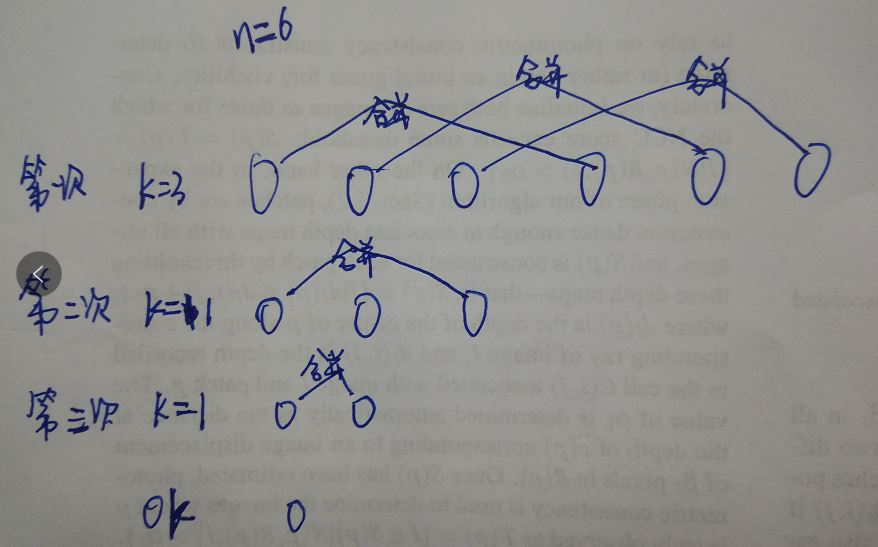

#<center>  LeetCode练习  </center>  
---  
<font size=4>  
##1.Three Sum  

- 思路：三数之和就相当于两数之和的target的是变化的，所以先排序（从小到大），然后遍历数组，获取target（注意去除重复元素），然后对该元素右侧的所有元素求两数之和为target的组合（注意去除重复元素）。  
- 代码：  代码本地能过，可submit后显示Runtime Error，该问题未解决！！！

```  

	class Solution {
	public:
	    vector<vector<int>> threeSum(vector<int>& nums) {
	        vector<vector<int>> res={};
	        sort(nums.begin(),nums.end());//升序排序
	        for(int i=0;i<nums.size()-2;i++){
	            int j=i+1;
	            int k=nums.size()-1;
	            while(j<k){
	                if((nums[i]+nums[j]+nums[k])>0) 
	                    k--;
	                else if((nums[i]+nums[j]+nums[k])<0) 
	                    j++;
	                else{
	                    vector<int> tmp={nums[i],nums[j],nums[k]};
	                    res.push_back(tmp);
	                    while(nums[j+1]==nums[j]) j++;
	                    while(nums[k-1]==nums[k]) k--;
	                    j++;
	                }    
	            }
	            while(nums[i+1]==nums[i]) i++;
	        }
	        return res;       
	    }
	};

```

##2.Majority Element  

- 摩尔投票法Moore Voting：  时间：O(n) 空间：O(1)    缺点：前提是众数存在    
1)假设第一个数为众数，然后计数器加1；  
2)比较下一个数是否和该数相等，若相等，计数器加1，否则计数器减1；  
3)比较下一个数时先判断计数器是否为0，若为0，则直接将下一个数设为众数；  
4)遍历完整个数组，当前存储的数即为数组的众数。  

```

	class Solution {
	public:
	    int majorityElement(vector<int>& nums) {
	        int res,cnt=0;
	        for(int i=0;i<nums.size();i++){
	            if(cnt==0){
	                res=nums[i];cnt++;
	            }
	            else{
	                (nums[i]==res)? cnt++ : cnt-- ;
	            }
	        }    
	        return res;
	    }
	};

```

- 哈希表实现：   

```

	class Solution {
	public:
	    int majorityElement(vector<int>& nums) {
	        unordered_map<int,int> counts;
	        int n=nums.size();
	        for(int i=0;i<n;i++){
	            if(++counts[nums[i]]>n/2)
	                return nums[i];
	        }
	        return -1;
	    }
	};

```

- 位操作：超厉害的方法，**将中位数按位来建立**，从0~31位，每次统计下数组中该位上0和1的个数，如果1多，那么我们将结果res中该位变为1，最后累加出来的res就是中位数了

```

	class Solution {
	public:
	    int majorityElement(vector<int>& nums) {
	        int res=0,n=nums.size();
	        for(int i=0;i<32;i++){
	            int ones=0,zeros=0;
	            for(int j=0;j<n;j++){
	                if(ones>n/2 || zeros>n/2) break;
	                if(nums[j]&(1<<i)) ones++;
	                else zeros++;
	            }
	            if(ones>zeros) res|=(1<<i);
	        }
	        return res;
	    }
	};

```


##3.First Missing Positive(求缺失的第一个整数)     
  
- 题目分析：该题限定时间O(n)空间O(1),因此不能用排序及hash表；  
- 思路：改变元素在数组中的位置,把1放在nums[0],2放在nums[1],即nums[i]放在nums[nums[i]-1]中  
1)遍历整个数组，若nums[i]!=i+1,且nums[i]不大于n,且nums[i]不等于nums[nums[i]-1]时，将两者位置调换;  
2)再遍历一遍数组,如果对应位置上的数不正确则返回正确的数  
- 实现过程如图：  
<div align="center"></div>
```

	class Solution {
	public:
	    int firstMissingPositive(vector<int>& nums) {
	        int n=nums.size();
	        for(int i=0;i<n;i++){
	            while(nums[i]>0&&nums[i]<=n&&nums[i]!=nums[nums[i]-1]){
	                swap(nums[i],nums[nums[i]-1]);
	            }
	        }
	        for(int i=0;i<n;i++){
	            //检查数组元素的值是否在正确的位置
	            if(nums[i]!=i+1) return i+1;
	        }
	        //若一直找到了，则返回n+1
	        return n+1;
	    }
	};

```

##4.Linked List Circle I(判断链表是否有环)    

- 快慢指针：慢指针每次走一步，快指针每次走两步，若有环，肯定会相遇  

```

	/**
	 * Definition for singly-linked list.
	 * struct ListNode {
	 *     int val;
	 *     ListNode *next;
	 *     ListNode(int x) : val(x), next(NULL) {}
	 * };
	 */
	class Solution {
	public:
	    bool hasCycle(ListNode *head) {
	        if(head==NULL||head->next==NULL) return false;
	        ListNode *slow=head,*fast=head;
	        while(fast->next!=NULL&&fast->next->next!=NULL){
	            slow=slow->next;
	            fast=fast->next->next;
	            if(slow==fast) return true;
	        }
	        return false;
	    }
	};

```

##5.Merge k Sorted Lists(合并k个排序链表)   
最先想到的就是两两合并，前两个合并，合并好之后和第三个合并，以此类推，但这种方法效率不高。  
- 两两合并：用到分治法，即不停的折半合并。假设合并6个列表,  
1)首先分别合并0和3，1和4，2和5;然后合并3个列表，合并0和2；然后合并两个链表，合并0和1；
2)代码中的k是通过 (n+1)/2 计算的，这里为啥要加1呢，这是为了当n为奇数的时候，k能始终从后半段开始,当n是偶数的时候，加1也不会有影响.过程如下图  
<div align="center"></div>

```

	/**
	 * Definition for singly-linked list.
	 * struct ListNode {
	 *     int val;
	 *     ListNode *next;
	 *     ListNode(int x) : val(x), next(NULL) {}
	 * };
	 */
	class Solution {
	public:
	    ListNode* mergeKLists(vector<ListNode*>& lists) {
	        if(lists.empty()) return NULL;
	        int n=lists.size();
	        while(n>1){
	            int k=(n+1)>>1;
	            for(int i=0;i<n/2;i++){
	                lists[i]=MergeTwoLists(lists[i],lists[i+k]);
	            }
	            n=k;
	        }
			return lists[0];
	    }
	    ListNode* MergeTwoLists(ListNode* l1,ListNode* l2){
	        ListNode* dummy=new ListNode(sizeof(ListNode));
	        ListNode* cur=dummy;
	        while(l1&&l2){
	            if(l1->val < l2->val){
	                cur->next=l1;
	                l1=l1->next;
	            }else{
	                cur->next=l2;
	                l2=l2->next;
	            }
	            cur=cur->next;
	        }
	        if(l1) cur->next=l1;
	        if(l2) cur->next=l2;
	        return dummy->next;
	    }
	};

```

- 最小堆：在网上还看到了另一种方法，代码看起来很吃力，没有自己实现，先拷贝过来，以后有空再理解

```

	class Solution {
	public:
	    ListNode* mergeKLists(vector<ListNode*>& lists) {
	        auto cmp = [](ListNode*& a, ListNode*& b) {
	            return a->val > b->val;
	        };
	        priority_queue<ListNode*, vector<ListNode*>, decltype(cmp) > q(cmp);
	        for (auto node : lists) {
	            if (node) q.push(node);
	        }
	        ListNode *dummy = new ListNode(-1), *cur = dummy;
	        while (!q.empty()) {
	            auto t = q.top(); q.pop();
	            cur->next = t;
	            cur = cur->next;
	            if (cur->next) q.push(cur->next);
	        }
	        return dummy->next;
	    }
	};

```
</font>