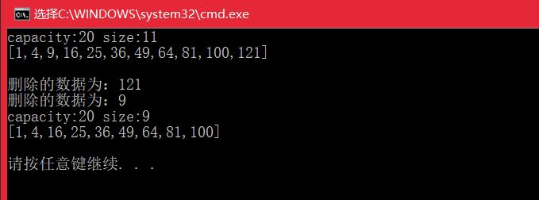
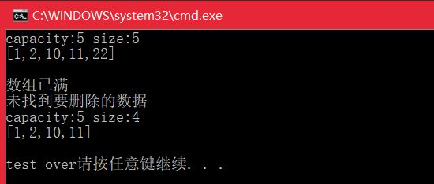
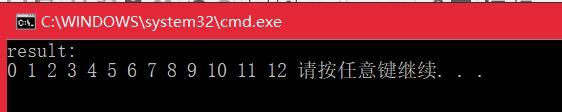

#<center>  数组练习总结  </center>
---  
##数组  
<font size=4>  
**1.实现一个支持动态扩容的数组**  

- **问题描述：**  定义一个动态扩容的数组类，能够往该类的对象插入数据，定义对象时，设置数组初始大小，插入数据时，若数组空间不够，则修改对象空间为当前的两倍；同时也支持删除数据。
- **具体思路：**  1)该类成员包括数据、总容量、数组当前大小；2)成员函数包括尾插、删除、删除指定位置（当然也可以实现删除指定数据）、重分配内存、返回数组大小、容量、打印函数等。
- **代码实现：**  

```   

	#include <iostream>
	using namespace std;
	const int initLen = 10;
	template < class T>
	class DynamicArray
	{
	public:
		DynamicArray(int len=initLen){
			data = new T[len];
			capacity = len;
			size = 0;
		}
		~DynamicArray(){
	
		}
	
	private:
		T *data;
		int capacity;//数组容量
		int size;//数组当前大小
	
	public:
		void resize(int len){
			T *p = new T[len];
			for (int i = 0; i < size;i++)
			{
				p[i] = data[i];
			}
			delete data;
			data = p;
			capacity = len;
		}
		//尾部插入
		void insert(T num){
			if (size >= capacity) resize(2 * capacity);
			data[size++] = num;
		}
		void removeLast(T &val){
			if (size <= 0) return;
			val = data[size - 1];
			size--;
			if (size < capacity / 4) resize(capacity / 2);
		}
		//删除第n个数
		void remove(int n, T &val){
			if (n <= 0 || n>size || size <= 0) return;
			val = data[n - 1];
			for (int i = n - 1; i < size-1;i++)
			{
				data[i] = data[i + 1];
			}
			size--;
			if (size < capacity / 4) resize(capacity / 2);
		}
		void print(){
			cout << "capacity:" << capacity << " size:" << size << endl<<"[";
			for (int i= 0; i < size;i++)
			{
				cout << data[i];
				if (i != size - 1) cout << ',';
			}
			cout << "]\n\n";
		}
		bool isEmpty(){
			return size == 0;
		}
		int capacity_(){
			return capacity;
		}
		int size_(){
			return size;
		}
	};
	
	int main(int argv, char *argc[]){
		DynamicArray<int> da(5);
		//插入11个数
		for (int i = 1; i <= 11;i++)
		{
			da.insert(i*i);
		}
		da.print();
		int delData;
		da.removeLast(delData);
		cout << "删除的数据为：" << delData << endl;
		da.remove(3, delData);
		cout << "删除的数据为：" << delData << endl;
		da.print();
	
		return 0;
	}
```      
代码运行结果：  


**2.实现一个大小固定的有序数组，支持动态增删操作**  

- **问题描述：**  定义一个类，往该类的对象中插入和删除数据时，要维护对象的数组中保持有序，如果超过数组大小，则不能再插入；
- **实现思路：**  1）类成员包括数组指针（指向固定大小的空间）、容量、当前大小；2）成员函数包括插入、删除、打印元素；
- **代码实现：**  

```  

	#include <iostream>
	using namespace std;
	const int initLen = 10;
	template < class T>
	class SortedArray{
	public:
		SortedArray(int len=initLen){
			data = new T(len);
			capacity = len;
			size = 0;
		}
		~SortedArray(){
	
		}
	private:
		T *data;
		int capacity;
		int size;
	public:
		void insert(T num){
			if (size >= capacity){
				cout << "数组已满\n"; return;
			}
			int i = 0;
			while (data[i] < num&&i<size) i++;
			for (int j=size-1;j>=i;j--)
			{
				data[j+1] = data[j];
			}
			data[i] = num;
			size++;
		}
		void remove(T num){
			if (size<=0)
			{
				cout << "数组为空\n"; return;
			}
			int i = 0;
			while (i < size&&data[i] != num) i++;
			if (i>=size)
			{
				cout << "未找到要删除的数据\n"; return;
			}
			else{
				for (; i < size-1;i++)
				{
					data[i] = data[i + 1];
				}
				size--;
			}
		}
		void print(){
			cout << "capacity:" << capacity << " size:" << size << endl << "[";
			for (int i = 0; i < size; i++)
			{
				cout << data[i];
				if (i != size - 1) cout << ',';
			}
			cout << "]\n\n";
		}
	};
	int main(int argv, char *argc[]){
		SortedArray<int> sa(5);
		sa.insert(2);
		sa.insert(22);
		sa.insert(1);
		sa.insert(11);
		sa.insert(10);
		sa.print();
		sa.insert(20);
		sa.remove(22);
		sa.remove(20);
		sa.print();
		cout << "test over";
		return 0;
	}
```
代码运行结果：  


**3.实现两个有序数组合并为一个有序数组**  

- **代码实现：**  

```  

	#include <iostream>
	using namespace std;
	void mergSortedArray(int *n1,int *n2,int len1,int len2,int *ans){
		int i = 0, j = 0, k = 0;
		while (i<len1&&j<len2)
		{
			if (n1[i] < n2[j] && i < len1){
				ans[k++] = n1[i++];
			}
			else if(j<len2){
				ans[k++] = n2[j++];
			}
		}
		while (i<len1) ans[k++] = n1[i++];
		while (j<len2) ans[k++] = n2[j++];
	}
	int main(int argv, char *argc[]){
		int n1[5] = { 1, 3, 5, 7, 9 };
		int n2[8] = { 0, 2, 4, 6, 8, 10, 11, 12 };
		int ans[50] = { 0 };
		mergSortedArray(n1, n2, 5,8,ans);
		int len = (sizeof(n1)+sizeof(n2)) / sizeof(int);
		cout << "result:\n";
		for (int i = 0; i < len;i++)
		{
			cout << ans[i] << ' ';
		}
		return 0;
	}

```  
代码运行结果：  


**4.学习哈希思想，完成leetcode上两数之和(1)和Happy Number(202)**  
 
- **哈希思想的特点:**  
  (1) 输入的数据范围有限  
  (2) 存在key-value的对应关系

- **两数之和：**  
1）使用unordered_map<int,int>存储出现过的数据以及该数与target之差；  
2）遍历数组中的元素，将出现过的值作为key，将该值的下标作为value存入map中；  
3）如果数组中某个元素的值与target之差作为key，在map中，则返回value和该元素的下标。   

```  

	//Time:O(n)
	//Space:O(n)
	class Solution {
	public:
	    vector<int> twoSum(vector<int>& nums, int target) {
	        unordered_map<int,int> record;
	        
	        for(int i=0;i<nums.size();i++){
	            int complement=target-nums[i];
	            if(record.find(complement)!=record.end()){
	                int res[]={record[complement],i};
	                return vector<int>(res,res+2);
	            }            
	            record[nums[i]]=i;
	        }
	        return vector<int> {0};
	    }
	};
```

- **happy Number:**  
1)改题的解题思路不难，定义一个函数获得每个数的个位数字平方和，然后判断是否为1；
2)这样执行的结果有两个，要么数字n最终变为1，要么无限循环始终不会变为1，因此改题的终点就是判断是否有数字出现了循环，需要使用哈希表！  

```  

	class Solution {
	public:
	    bool isHappy(int n) {
	        unordered_map<int,int> record;
	        while(n!=1){
	            if(record[n]==0) record[n]++;
	            else return false;
	            int sum=0;
	            while(n){
	                sum+=pow(n%10,2);
	                n/=10;
	            }
	            n=sum;
	        }
	        return true;
	    }
	};  
 
```

</font>  
