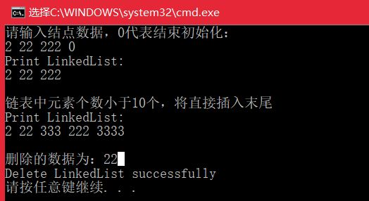

#<center>链表练习总结</center>
---
##链表
<font size=4>
**1.实现单链表、循环链表、双向链表，支持增删操作**  
 1)单链表：创建一个链表Node以及多个函数（创建链表、插入结点、删除结点、打印结点、销毁链表），代码如下：  

```   

	#include <iostream>
	using namespace std;
	typedef int ElementType;
	typedef struct node{
		ElementType data;
		struct node *next;
	}Node,*pNode;
	pNode  creatList(){
		//创建链表时最好创建一个头节点，该节点不存放数据，它指向第一个元素
		pNode head = (pNode)malloc(sizeof(Node));
		if (head == nullptr) return nullptr;
		head->next = nullptr;
		return head;
	}
	//直接插入尾部
	void insertLast(pNode head,ElementType data){
		if (head == nullptr) return ;
		pNode p = head;
		while (p->next)   p = p->next;
		//插入p后面
		pNode pNew=(pNode)malloc(sizeof(Node));
		pNew->data = data;
		pNew->next = nullptr;
		p->next = pNew;
	}
	//在第n个结点后插入
	void insert(pNode head, int n, ElementType data ){
		if (head == nullptr||n<=0) return;
		pNode p = head;
		int i = 1;
		while (i<=n&&p->next)
		{
			p = p->next; 
			i++;
		}
		if (i <= n) cout << "链表中元素个数小于" << n << "个，将直接插入末尾\n";
		//直接插入p后面
		pNode pNew = (pNode)malloc(sizeof(Node));
		pNew->data = data;
		pNew->next = p->next;
		p->next = pNew;
	}
	//删除第n个结点
	void deleteNth(pNode head,int n){
		if (head == nullptr ||head->next==nullptr|| n <= 0) return;
		pNode p = head;
		int i = 1;
		while (i < n&&p->next->next)
		{
			p = p->next;
			i++;
		}
		//删除p后面的结点,即p为删除结点的前一个结点
		if (i < n - 1){
			cout << "链表中元素个数小于" << n << "个，删除失败\n"; return;
		}
		pNode pdel = p->next;
		p->next = p->next->next;
		delete(pdel);
	}
	void print(pNode head){
		if (head == nullptr) return;
		pNode p = head;
		cout << "Print LinkedList:\n[";
		while (p->next)
		{
			cout << p->next->data;
			if (p->next->next!= nullptr) cout << ',';
			p = p->next;
		}
		cout << "]\n\n";
	}
	void destory(pNode head){
		if (head == nullptr) return;
		pNode p = head;
		while (p->next)
		{
			pNode pdel = p->next;
			p->next = p->next->next;
			delete pdel;
		}
		delete p;
		cout << "Delete LinkedList successfully\n";
	}
	
	int main(int argv, char *argc[]){
		pNode linkList = creatList();
		insertLast(linkList, 2);
		insertLast(linkList, 22);
		insertLast(linkList, 222);//尾插
		print(linkList);
		insert(linkList, 2, 333);//在第2个结点后插入
		print(linkList);
		deleteNth(linkList, 2);//删除第2个结点
		deleteNth(linkList,10);
		print(linkList);
		return 0;
	}  

```

代码运行结果：  
  
2)循环链表  
注：初始化函数中传递的是*head，只要是修改head指针必须传递head的地址，否则传递head的值即可。 可参照下图理解链表初始化：  
  
```  

	#include <iostream>
	#include "stdio.h"
	using namespace std;
	typedef struct node{
		int data;
		struct node *next;
	}Node, *pNode;
	void initCLinkedList(pNode *list){//list代表头节点，不存放数据
		if (list == nullptr) return;
		int data = 0;
		pNode target=nullptr, head = nullptr;
		//插入新结点时，判断：如果链表为空，则创建一个链表，指针域指向自己，否则寻找尾节点target，
		//尾结点指针域指向新节点，新节点指针域指向头节点 
		cout << "请输入结点数据，0代表结束初始化：\n";
		while (cin >> data&&data!=0){
			if (*list==nullptr)
			{
				pNode head = (pNode)malloc(sizeof(Node));
				if (head == nullptr) exit(0);
				*list = head;
				pNode node = (pNode)malloc(sizeof(Node));
				node->data = data;
				node->next = head;
				head->next = node;
			}
			else{
				for (target = (*list)->next; target->next!=(*list); target = target->next);//找到尾结点
				pNode node = (pNode)malloc(sizeof(Node));
				node->data = data;
				node->next = (*list);//新节点指向头节点
				target->next = node;//尾结点指向新节点
			}
		}
		return;
	}
	void print(pNode head){
		if (head == nullptr) return;
		pNode p = head;
		cout << "Print LinkedList:\n";
		do{
			if (p->next!=head)
				cout << p->next->data<<' ';
			p = p->next;
		} while (p != head);
		cout << "\n\n";
	}
	//在第n个结点后插入，和单链表实现方法一样,只是跳出循环的条件不一样
	void insert(pNode head,int n,int data){
		if (head == nullptr || n <= 0) return;
		pNode p = head;
		int i = 1;
		while (i <= n&&p->next!=head)
		{
			p = p->next;
			i++;
		}
		if (i <= n) cout << "链表中元素个数小于" << n << "个，将直接插入末尾\n";
		//直接插入p后面
		pNode pNew = (pNode)malloc(sizeof(Node));
		pNew->data = data;
		pNew->next = p->next;
		p->next = pNew;
	}
	//删除第n个结点
	void delNthNode(pNode head, int n, int &data){
		if (head == nullptr || head->next == nullptr || n <= 0) return;//中间的判断属于链表为空
		pNode p = head;
		int i = 1;
		while (i < n&&p->next->next!=head)
		{
			p = p->next;
			i++;
		}
		//删除p后面的结点,即p为删除结点的前一个结点
		if (i < n - 1){
			cout << "链表中元素个数小于" << n << "个，删除失败\n"; return;
		}
		pNode pdel = p->next;
		p->next = p->next->next;
		data = pdel->data;
		delete(pdel);
	}
	void destory(pNode head){
		if (head == nullptr) return;
		pNode p = head;
		
		do{
			pNode pdel = p->next;
			p->next = p->next->next;
			delete pdel;
		}while (p!=head);
		delete p;
		cout << "Delete LinkedList successfully\n";
	}
	
	int main(int argv, char *argc[]){
		pNode list = nullptr;
		initCLinkedList(&list);
		print(list);
		insert(list, 2, 333);//在第2个结点后插入
		insert(list, 10, 3333);//超过结点个数，将在尾部添加
		print(list);
		int ret = 0;
		delNthNode(list, 2, ret);
		cout << "删除的数据为：" << ret << endl;
		destory(list);
		return 0;
	}  

```
代码运行结果：  
   

**2.实现单链表反转**  

- 反转思路：设三个指向结点的指针  
 
- LeetCode代码  

```

	/**
	 * Definition for singly-linked list.
	 * struct ListNode {
	 *     int val;
	 *     ListNode *next;
	 *     ListNode(int x) : val(x), next(NULL) {}
	 * };
	 */
	class Solution {
	public:
	    ListNode* reverseList(ListNode* head) {
	        ListNode *pCur=head,*pNext=NULL,*pRev=NULL;
	        while(pCur){
	            pNext=pCur->next;
	            pCur->next=pRev;
	            pRev=pCur;
	            pCur=pNext;
	        }
	        return pRev;
	    }
	};
```

**3.实现两个有序链表合并为一个有序链表**   

- LeetCode代码  
注意：LeetCode上传进来的head即第一个结点，为了返回链表需要，最好定义一个dummy结点ret。合并思路和合并数组一样。 

```  

	/**
	 * Definition for singly-linked list.
	 * struct ListNode {
	 *     int val;
	 *     ListNode *next;
	 *     ListNode(int x) : val(x), next(NULL) {}
	 * };
	 */
	class Solution {
	public:
	    ListNode* mergeTwoLists(ListNode* l1, ListNode* l2) {
	        ListNode *ret=new ListNode(0);
	        ListNode *tmp=ret;
	        while(l1!=NULL&&l2!=NULL){
	            if(l1->val<l2->val){
	                tmp->next=l1;
	                l1=l1->next;
	            }else{
	                tmp->next=l2;
	                l2=l2->next;
	            }
	            tmp=tmp->next;
	        }
	        if(l1){
	            tmp->next=l1;
	        }
	        if(l2){
	            tmp->next=l2;
	        }
	        return ret->next;
	    }
	};  

```
**4.实现求链表的中间结点**  

- 解题思路：使用快慢指针，并分为两种情况，pfast->next不满足跳出循环(结点数为奇数)pfast->next->next不满足跳出循环(结点数为偶数)。
- LeetCode代码  

```
  
	/**
	 * Definition for singly-linked list.
	 * struct ListNode {
	 *     int val;
	 *     ListNode *next;
	 *     ListNode(int x) : val(x), next(NULL) {}
	 * };
	 */
	class Solution {
	public:
	    ListNode* middleNode(ListNode* head) {
	        ListNode *pfast=head,*pslow=head;
	        while(pfast->next&&pfast->next->next){
	            pfast=pfast->next->next;
	            pslow=pslow->next;
	        }
	        if(pfast->next==NULL)
	            return pslow;
	        else
	            return pslow->next;
	    }
	};

```

</font>