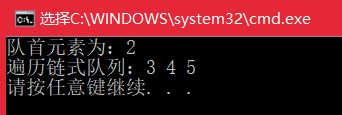

# <center>  队列练习总结  </center>

---  
<font size=4>  

队列和栈一样，也是一种操作受限的线性表数据结构，先进先出（FIFO）。队列的应用非常广泛，特别是一些具有某些额外特性的队列，如循环队列、阻塞队列、并发队列。  
##  1.用数组实现一个顺序队列   
- **问题分析：**  依然使用模板构造类，数组实现的队列支持动态扩容，但是由于入队放数组末尾，出队从数组头部拿数据，因此会造成数组空间浪费，若使用循环队列则能解决这个问题。  

```

	#include <iostream>
	using namespace std;
	const int initialLen = 10;
	template <typename T>
	class ArrayQueue{
	public:
		ArrayQueue(int cap = initialLen){
			T *p = new T[cap];
			data = p;
			capacity = cap;
			size = 0;
			head = 0; 
		}
		~ArrayQueue(){
			delete []data;
		}
		bool isEmpty(){
			return size == 0;
		}
		bool isFull(){
			return size == capacity;
		}
		int Size(){
			return size;
		}
		void reSize(int len){
			T *p = new T[len];
			for (int i = 0; i < size;i++)
			{
				p[i] = data[i];
			}
			delete []data;
			data = p;
			capacity = len;
		}
		void traverse(){
			cout << "Array: ";
			cout << "Capacity = " << capacity << ", " << "Size = " << size-head << endl;
			cout << '[';
			for (int i = head; i < size; ++i){
				cout << data[i];
				if (i != size - 1){
					cout << ',';
				}
			}
			cout << ']' << endl;		
		}
		void Push(T x){
			if (size == capacity) reSize(capacity * 2);
			data[size] = x;
			size++;
		}
		T Pop(){
			T ret = data[head];
			head++;
			return ret;
		}
		T Front(){
			return data[head];
		}
	private:
		T *data;
		int capacity;
		int size;
		int head;
	};
	
	int main(){
		ArrayQueue<int> queue(5);
		queue.Push(2);
		queue.Push(22);
		queue.Push(222);
		queue.Push(3333);
		queue.Push(33333);
		queue.Push(333333);
		queue.Pop();
		cout << "此时队首元素为：" << queue.Front()<<endl;
		queue.traverse();
	
		return 0;
	}


```  
  

## 2.用链表实现一个顺序队列
- **问题分析：**  单链表表示的链式队列特别适合于数据元素变动较大的情形，不存在溢出的情况。  

```

	#include <iostream>
	using namespace std;
	template <typename T>
	struct LinkNode{
		T data;
		struct LinkNode<T> *next;
		LinkNode(T& x, struct LinkNode<T> *p = nullptr){
			data = x;
			next = p;
		}
	};
	template <typename T>
	class LinkedQueue
	{
	public:
		LinkedQueue(){
			front = rear = nullptr;
		}
		~LinkedQueue(){
			DestoryList();
		}
	
	private:
		LinkNode<T> *front, *rear;
	
	public:
		bool Push(T data){
			LinkNode<T> *node = new LinkNode<T>(data);
			if (front == nullptr)
				front = rear = node;
			else{
				rear->next = node;
				rear = rear->next;
			}
			return true;
		}
		bool Pop(T& x){
			if (isEmpty()) return false;
			LinkNode<T> *del=front;
			front = front->next;
			x = del->data;
			delete del;
			return true;
		}
		//该成员函数加了const，意思是该函数不能更改类数据成员的值
		//一旦企图更改，编译器按错误处理，提高程序的可读性
		bool Front(T& x) const{//取队首元素
			if (isEmpty()) return false;
			x = front->data;
			return true;
		}
		bool isEmpty(){
			return (front == rear) ? true : false;
		}
		int Size(){
			int ret=0;
			LinkNode<T> *p=front;
			while (p)
			{
				ret++;
				p = p->next;
			}
			return ret;
		}
		void Traverse(){
			LinkNode<T> *p=front;
			cout << "遍历链式队列：";
			while (p)
			{
				cout << p->data << ' ';
				p = p->next;
			}
			cout << endl;
		}
		void DestoryList(){
			LinkNode<T> *p;
			while (front)
			{
				p = front;
				front = front->next;
				delete p;
			}
		}
	};
	
	int main(){
		LinkedQueue<int> queue;
		queue.Push(2);
		queue.Push(3);
		queue.Push(4);
		queue.Push(5);
		int a; 
		queue.Front(a);
		cout << "队首元素为：" << a<<endl;
		queue.Pop(a);//将队首元素删除，并放在a中
		queue.Traverse();
		queue.DestoryList();
		return 0;
	}

```  

- **运行结果：**  
     

## 3.实现一个循环队列
- **问题分析：** 前面提到过用数组实现队列会造成空间浪费，可能队首的元素已经出队，但前面的空间无法被利用的情况，那么，用循环队列就能很好的解决这个问题。  
但是目前还有个问题需要解决，即判断队空和队满的情况。  
- **解题思路：**  
   

- **代码实现：**  

```

	#include <iostream>
	using namespace std;
	template<typename T>
	class CircleQueue{
	private:
		T *data;
		int front, rear;
		int capacity;
	public:
		CircleQueue(int sz=10){
			front = rear = 0;
			capacity = sz;
			data = new T[capacity];
		}
		~CircleQueue(){
			delete[] data;
		}
		bool Push(T x){//EnQueue
			if (isFull()) {
				cout << "队列已满\n";
				return false;
			}
			data[rear] = x;
			rear = (rear + 1) % capacity;
			return true;
		}
		bool Pop(T& x){//DeQueue
			if (isEmpty()) return false;
			x = data[front];
			front = (front + 1) % capacity;
			return true;
		}
		T Front(){//take the front element
			if (isEmpty()) return -1;
			return data[front];
		}
		bool isEmpty(){
			return (front == rear) ? true : false;
		}
		bool isFull(){
			return ((rear + 1) % capacity == front) ? true : false;
		}
		void makeEmpty(){
			front = rear;
		}
		void Traverse(){
			for (int i = front;i!=rear;i=(i+1)%capacity)
			{
				cout << data[i] << ' ';
			}cout << endl;
		}
	};
	int main(){
		CircleQueue<int> queue(5);
		queue.Push(2);
		queue.Push(22);
		queue.Push(222);
		queue.Push(333);
		int x;
		queue.Pop(x);
		cout << "出队的元素为：" << x << endl;
		queue.Push(333);
		queue.Push(444);//此时队列已满
		queue.Traverse();//遍历队列
		return 0;
	}


```  

- **运行结果：**   

   


## 4.学习小结  
- 在看网上代码时又发现了一个怪像，size_t! 以前没用过，在此学习一下。 size_t其实是一种类型，类似于无符号整形（unsignted int） 
-   size_t是一些C/C++标准在stddef.h中定义的。这个类型足以用来表示对象的大小。size_t的真实类型与操作系统有关。
在32位架构中被普遍定义为：
typedef   unsigned int size_t;  
而在64位架构中被定义为：
typedef  unsigned long size_t;  
size_t在32位架构上是4字节，在64位架构上是8字节，在不同架构上进行编译时需要注意这个问题。而int在不同架构下都是4字节，与size_t不同；且int为带符号数，size_t为无符号数。


</font>