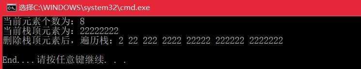
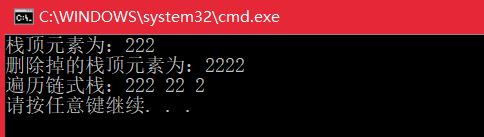
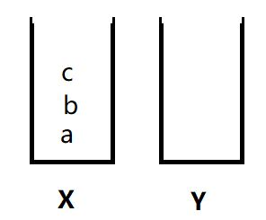
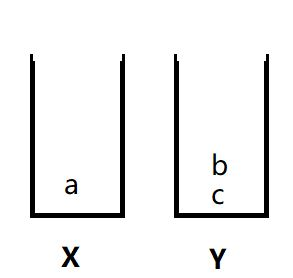
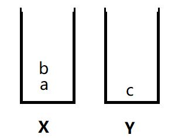
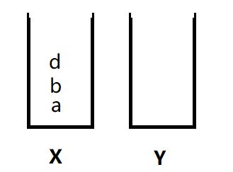

# <center>  栈练习总结  </center>  

---  
<font size=4>

栈是一种操作受限的线性表，先进后出(FILO)，只允许在一端插入和删除数据。它有两种存储结构，分别是顺序存储和链式存储。    
## 1.用数组实现一个顺序栈（须支持动态扩容）  
- **问题分析：**  用数组模拟的栈是顺序栈，基本操作有八个：入栈、出栈、是否为空、取栈顶元素、取有效元素个数、遍历。  
- **具体思路：**   代码实现起来不难，但需要注意数组扩容问题，以及内存释放。 入栈时直接将值存到数组末尾，出栈时删除数组末尾元素即可。  
- **代码实现：**  

```

	#include <iostream>
	using namespace std;
	
	
	const int DEFAULT_SIZE =20;
	template <class T>
	class SeqStack
	{
	public:
		SeqStack(int cap=DEFAULT_SIZE){//创建栈
			capacity = cap;
			_array = new T[capacity];
			size = 0;
		}
		~SeqStack(){
			delete []_array;
		}
		bool isEmpty(){
			return size == 0;
		}
		void Push(const T& data){//入站
			CheckCapicity();//检查容量
			_array[size] = data;
			size++;
		}
		void Pop(){//出栈
			if (size == 0) return;
			size--;
		}
		T Top(){//取栈顶元素
			if (isEmpty()) return -1;
			return _array[size - 1];
		}
		int Size(){//栈当前元素个数
			return size;
		}
		void Traverse(){
			for (int i = 0; i < size;i++)
			{
				cout << _array[i] << ' ';
			}
			cout << endl;
		}
	
	private:
		T* _array;
		int capacity;
		int size;
	
		void CheckCapicity(){//检查容量（扩容）
			if (size == capacity){//栈满扩容	
				//开辟新空间是原来大小的两倍
				capacity +=capacity;
				T* new_array = new T[capacity];
				if (new_array == nullptr) { cout << "error";  return; }
				//拷贝数据
				for (int i = 0; i < size; i++)
				{
					new_array[i] = _array[i];
				}
				//释放原来的空间
				delete[] _array;
				_array = new_array;
			}
			else
				return;
		}	
	};
	
	int main(int argv, char *argc[]){
		SeqStack<int> stack(5);
		int val = 2;
		for (int i = 0; i < 8;i++)
		{
			stack.Push(val);
			val = val * 10 + 2;
		}
		cout << "当前元素个数为：" << stack.Size() << endl;
		cout << "当前栈顶元素为：" << stack.Top()<<endl;
		stack.Pop();
		cout << "删除栈顶元素后，遍历栈：";
		stack.Traverse();
	
		cout << "\nEnd....";
		return 0;
	}

```  

- 结果显示：  
  

- 小结：
1)程序执行扩容时电脑死了，原因是分配空间是使用了new()进行申请，之前没有注意到过new()和new[]的区别，特意去看了下，
>char *pc = new char('a'); //开辟一个内存单元，并用括号里的初始化  
char *pca = new char[15]; //开辟一个数组  
释放内存的方法也不一样:  
delete pc;  
delete []pc;  

更详细的解释也可参考：<https://www.cnblogs.com/wangpei0522/p/4476470.html>

## 2.用链表实现栈（栈大小不受限，但相比于顺序栈，须存储next指针，内存消耗相对较多）
- **问题分析：**  用链表实现堆栈，不需要考虑堆栈空间不够用。由于单链表的头指针位置不变，因此头节点即栈顶元素，入栈时采用头插法插入结点、出栈时将头节点删除，然后释放该节点的内存。  
- **实现思路：**  构建了一个LinkStack类，该类包含链表结点的定义、指向链表头节点的指针top，类函数有入站、出栈、取栈顶元素、判断栈是否为空、从头遍历栈。其中结构体node中有两个构造函数。  
- **代码实现：**  

```

	#include <iostream>
	using namespace std;
	template <class T>
	class LinkStack{
	private:
		struct node{
			T data;
			struct node *next;
			node(const T &x, node *N = nullptr){
				data = x; next = N;
			}
			node() :next(nullptr){}
			~node(){}
		};
		struct node *top;
	public:
		LinkStack(){ top = nullptr; }
		~LinkStack(){
			node *tmp;
			while (top!=nullptr)
			{
				tmp = top;
				top = top->next;
				delete tmp;
			}
		}
		bool isEmpty() {
			return top == nullptr;
		}
		T Top(){
			if (top == nullptr) return -1;
			return top->data;
		}
		T Pop(){
			node *del = top;
			T x = top->data;
			top = top->next;
			delete del;
			return x;
		}
		void Push(const T &x){
			node *newNode = new node(x, top);//头插
			top = newNode;//新节点变为头节点
		}
		void Treverse(){
			node *tmp = top;
			while (tmp!=nullptr)
			{
				cout << tmp->data << " ";
				tmp = tmp->next;
			}cout << endl;
		}
	};
	
	int main(int argv, char* argc[]){
		LinkStack<int> stack;
		stack.Push(2);
		stack.Push(22);
		stack.Push(222);
		cout << "栈顶元素为：" << stack.Top()<<endl;
		stack.Push(2222);
		int  del = stack.Pop();
		cout << "删除掉的栈顶元素为：" << del << endl;
		cout << "遍历链式栈：";
		stack.Treverse();
		return 0;
	}

```  

- 代码测试结果：  
  

## 3.栈的应用  
- **函数调用：**  操作系统给每个线程分配了一块独立的空间，这块内存被组织成“栈”这种结构，用来存储函数调用时的临时变量，没进入一个函数，就会将临时变量作为一个栈帧入栈，当被调用函数执行完成，返回之后，将这个函数对应的栈帧出栈。  
- **表达式求值：**  通过两个栈来实现，其中一个保存操作数，另一个保存运算符。  
1）从左向右遍历表达式，遇到数字就直接压入操作数栈；遇到运算符，就与运算符栈的栈顶元素比较；  
2）如果比运算符栈顶元素的优先级高，就将当前运算符压入栈；如果比运算符栈顶元素的优先级低或相等，从运算符中取栈顶元素，从操作数栈顶取两个操作数，进行计算，再把计算完的结果压入操作数栈，继续比较当前运算符和运算符栈顶的优先级。  
- **括号匹配：**  借助栈来检查表达式中的括号是否匹配，假设表达式中只包含三种括号()[]{}，且它们可以任意嵌套，判断是否合法。  
1）用栈保存未匹配的左括号，从左到右依次扫描字符串。当扫到左括号时，则将其压入栈；
2）当扫到右括号时，从栈顶取出一个左括号。  
3）如果能够匹配，则继续扫描剩下的字符串，如果扫描的过程中，遇到不能配对的右括号，或者占中没有数据，则说明非法。  
4）当所有的括号都扫描完成之后，如果栈为空，则说明字符串合法，否则非法。  

## 4.编程模拟实现一个浏览器的前进、后退功能(使用两个栈解决)  

- **问题分析：**  一次访问完一串页面a-b-c之后，点击浏览器的后退按钮，就可以查看之前浏览过的页面b和a。当后退到页面a，点击前进按钮，还可以重新查看页面b和c。但是如果后退到页面b后，点击了新的页面d，那就无法再通过前进、后退功能查看页面c了。
- **实现思路：**  使用两个栈X和Y，把首次浏览的页面依次压入栈X，当点击后退按钮时，再依次从栈X中出栈，并将出栈的数据一次放入栈Y。当点击前进按钮时，依次从栈Y中取出数据，放入栈X中。当栈X中没有数据时，那就说明没有页面可以继续后退浏览了。当栈Y中没有数据，那就说明没有页面可以点击前进按钮浏览了。  
1）假设你顺序查看了a、b、c三个页面，就依次把它们压入栈，如图1   
  
2)通过浏览器后退按钮，从页面c后退到页面a之后，就依次把c和b从栈X中弹出，并依次放入栈Y，如图2  
  
3）此时你又想看页面b，于是你又点击前进按钮回到b页面，我们就把b从栈Y取出放入栈X中，如图3  
  
4）这时，你通过b跳转到了页面d，页面c就无法再通过前进、后退按钮查看了，所以需要清空栈Y,如图4  
  

- **伪代码：**  

```

	Stack< string> X=new Stack< strting>();  
	Stack< string> X=new Stack< strting>();  
	X.push("a")；//浏览a   
	X.push("b")；//浏览b  
	X.push("c")；//浏览c  
	//此时后退查看a  
	Y.push("c");
	X.pop();  
	Y.push("b");
	X.pop(); 
	//查看b  
	X.push("b");
	Y.pop(); 
	//打开新页面d  
	X.push("D");  
	Y.pop();//此时须清空y
``` 

## 5.学习小结——template< class T>和template< typename T >  
- 两者都可以用来定义函数模板和类模板 ，在使用上，两者没区别；后者typename指类型名，T可取 char、int、double等；前者用于类，T可以取任何类。但实际应用中，template< class T> 的 T 也可以取基础数据类型，tempate< typename T> 的 T 也可以取类。  
- 在C++早期版本，没有typename关键字，在后期版本中，为了不和class混淆，加入typename用以区分，建议：定义函数模板时，用typename关键字。


</font>