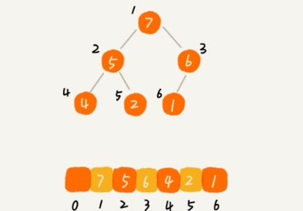
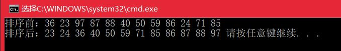

# <center>  排序  </center>

---  
<font size=4>  
冒泡、插入、选择排序时间复杂度为O(n^2),堆排序、归并、快排的时间复杂度为O(nlogn)，其中堆排序时间复杂度非常稳定，且是原地排序算法。    

## 1.归并排序  
**问题分析：**  归并排序是一个稳定的算法，比如希尔排序、快排和堆排序，这些算法有所谓的最好和最坏情况。而归并排序的时间复杂度是固定的,为O(nlogn)。  
1)分解--将当前区间一份为二，即求分裂点mid=(start+end)/2;  
2)求解--递归对两个子区间A[start-mid]和A[mid+1-end]进行递归排序，递归终止条件为区间长度为1；  
3)合并--将已排序的两个子区间A[start-mid]和A[mid+1-end]归并为一个有序的区间A[start-end]。  
**代码实现：**  

```

	void merge(vector<int> &A, int start,int mid, int end){
		int *tmp = new int[end-start+1];
		int i = start, j = mid + 1, k = 0;
		while (i<=mid&&j<=end)
		{
			if (A[i] < A[j])
				tmp[k++] = A[i++];
			else
				tmp[k++] = A[j++];
		}
		while (i <= mid) tmp[k++] = A[i++];
		while (j <= end) tmp[k++] = A[j++];
	
		//将排序后的元素覆盖到元素组
		for (i = 0; i < k; i++)
			A[start+i] = tmp[i];
		delete tmp;
	}
	void mergeSort(vector<int> &A, int start, int end){
		if (start >= end) return;
		int mid = (start + end) / 2;
		mergeSort(A, start, mid);
		mergeSort(A, mid + 1, end);
		merge(A,start,mid,end);
	}

```
 
## 2.快速排序  
**问题分析：**  快速排序是排序算法中比较重要的一种，其优点是时间复杂度为O(nlogn)，实现步骤如下：  
1)选定中枢点pivot value,中枢点可以选择中间的那个点，也可以选择末尾点，一般来说直接选取末尾点，如果末尾点的话要注意循环结束后要调换中枢点和第一个大于中枢点的数的位置。理论上来说中枢点可以为任意值，即使不在数组中；  
2)分割Partition，重新安排数字的顺序，让所有比中枢点小的数放到左边，所有大于中枢点的数放到右边，等于中枢点的数可以放在任意一边，这样数组就被分成了两段；  
3)调用递归算法给每一段排序。  
**代码实现：**  

```

	int partition(vector<int> &A, int start, int end){
		int i = start, j = end, pivot = A[end];
		while (i != j)
		{
			while (A[i] <= pivot&&i < j) i++;
			while (A[j] >= pivot&&i < j) j--;
			if (i < j)
				swap(A[i], A[j]);
		}
		swap(A[i], A[end]);
		return i;
	}
	void quickSort(vector<int> &A,int start,int end){
		if (start >= end) return;
		int pos = partition(A, start, end);
		quickSort(A, start, pos - 1);
		quickSort(A, pos+1, end);
	}

```


## 3.插入排序  
**问题分析：**  将数组中的数据分为两个区间，已排序区间和未排序区间。初始已排序区间只有一个元素，就是数组的第一个元素。插入排序的核心思想是取未排序区间的元素，在已排序区间中找到合适的插入位置将其插入，并保证已排序区间数据一直有序。重复这个过程，直到未排序区间中元素为空，算法结束。  
对于不同的查找插入点方法（从头到尾、从尾到头），数据的比较次数是有区别的，但对于一个给定的初始序列，移动操作的次数总是固定的，就等于逆序度。  

```

	void insertionSort(vector<int> &A){
		for (int i = 1; i < A.size();i++)
		{
			int tmp = A[i];
			int j = i - 1;//查找插入位置
			for (; j >= 0;j--)
			{
				if (A[j]>tmp)
					A[j + 1] = A[j];//数据移动
				else
					break;
			}
			A[j + 1] = tmp;//数据插入
		}
	}

```  

**总结：**  1)插入排序是原地排序算法，不需要额外的存储空间；2)是稳定的算法，对于值相同的元素，可以选择将后面出现的元素插入到前面出现元素的后面，这样就可以保持原有的前后顺序不变；3)如果要排序的数据已经是有序的，就并不需要搬移任何数据，如果从尾到头在有序数组中查找插入位置，每次只需要比较一个数据就能确定插入的位置，所以，最好的时间复杂度为O(n)，如果数组是倒序的，每次插入都相当于在数组的第一个位置插入新的数据，所以需要移动大量的数据，最坏情况的时间复杂度为O(n^2)。  

## 4.冒泡排序  
**问题分析：**  遍历数组，进行n-1轮排序，进行把当前数字和后面的数字比较，比当前小就跟当前数字交换，这样遍历的过程中，每一轮能将一个大的数字就像气泡一样移到到数组后面去

```

	void bubbleSort(vector<int> &A){
		for (int i = 1; i < A.size();i++)
		{
			for (int j = 0; j < A.size()-i;j++)
			{
				if (A[j] > A[j+1])
					swap(A[j], A[j+1]);
			}
		}
	}  

```

## 5.选择排序  
**问题分析：**  遍历数组，定义一个min_idx用来记录当前位置往后的最小值的坐标，通过遍历之后所有的数字找到最小值的坐标，然后交换A[i]和A[min_idx]即可：    

```

	void selectSort(vector<int> &A){
		for (int i = 0; i < A.size(); i++)
		{
			int min_idx = i;
			for (int j = i+1; j < A.size(); j++)
			{
				if (A[j] < A[min_idx])
					min_idx = j;
			}
			swap(A[i], A[min_idx]);
		}
	}

```
## 6.堆排序  
**1)理解堆：堆是一个完全二叉树；堆中每一个节点的值都必须大于等于(小于等于)其子树中每个节点的值。**  
**2)如何实现一个堆？** 堆支持插入、删除操作；完全二叉树比较适合用数组来存储，非常节省空间，我们不需要存储左右子节点的指针，单纯的通过数组的下标就可以找到一个节点的左右子节点和父节点，如下图,下标为i的节点的左子节点就是下标为i*2的节点，右子节点就是下标为i*2+1的节点，父节点就是下标为i/2的节点。    
  
**3)堆化(大顶堆为例)：**  往堆中插入一个元素后，需要继续满足堆的两个特性，于是就需要进行调整，让其重新满足堆的特性，这个过程称之为堆化。分从上往下和从下往上两种,顺着节点所在的路径，向上或向下，对比，然后交换。  
(1)插入元素后要堆化，采用**从下往上**的方法。将插入的数据放在数组最后，然后然插入的节点与其父节点对比，如果不满足子节点小于等于父节点的大小关系，就交换两个节点；一直重复这个过程，直到父子节点满足刚才说的那种大小关系。  
(2)删除堆顶元素后，需要把第二大的元素放到堆顶：把最后一个元素放到堆顶，然后利用父子节点对比方法，对于不满足父子节点关系的，互换两个节点，并且重复这个过程，直到父子节点满足大小关系为止(**从上往下**堆化)。  

**4)基于堆实现排序：**  大致分为两步，建堆和排序。  
(1)建堆：将数组原地建成一个堆，第一种思路是从前往后处理数组数据，假设起初堆中只包含一个数据，就是下标为1的数据，然后，调用插入操作，将小标从2~n的数据依次插入到堆中。第二种思路是从后往前处理，并且每个数据都是从上往下堆化，直接从第一个非叶子节点开始，依次堆化。(从数组下标为1的位置开始存储数据),代码如下：    

```

	void heapify(vector<int> &A,int n,int i){//从上到下
		while (true)
		{
			int maxpos = i;
			if (i * 2 <= n&&A[i] < A[i * 2]) maxpos = i*2;
			if (i * 2 + 1 <= n&&A[maxpos] < A[i * 2 + 1]) maxpos = i * 2 + 1;
			if (maxpos==i) break;//满足父子节点关系，堆化完成
			swap(A[maxpos],A[i]);
			i = maxpos;
		}
	}
	void buildHeap(vector<int>& A){
		for (int i = A.size() / 2; i >= 1;i--)
		{
			heapify(A, A.size(), i);
		}
	}

```   

(2)排序： 建堆结束后，数组中的数据已经是按照大顶堆的特性来组织的，数组中的第一个元素就是堆顶，即最大的元素。然后将它跟最后一个元素交换，那最大元素就放到了下标为n的位置。  
这个过程类似删除堆顶元素的操作，当堆顶元素移除之后，把下标为n的元素放到堆顶，然后堆化将剩下的n-1个元素重新构建成堆。堆化完成之后，再取堆顶元素放到下标为n-1的位置，一直重复这个过程，直到最后堆中只剩下下标为1的一个元素，排序就完成了。  

```

	void heapSort(vector<int>& A,int n){
		buildHeap(A,n);
		int k = n;
		while (k>1)
		{
			swap(A[1], A[k]);
			k--;
			heapify(A, k, 1);
		}
	}
	int main(){
		int tmp;
		vector<int> A(13);
		srand((unsigned)time(0));
		cout << "排序前：";
		for (int i = 1; i <= 12;i++)//下标从1~12进行存储
		{
			A[i] = rand() % 100;
			cout << A[i] << ' ';
		}
		cout << endl;
		heapSort(A,A.size()-1);
	
		cout << "排序后：";
		for (vector<int>::iterator iter = A.begin() + 1; iter != A.end(); iter++)
		{
			cout << *iter << ' ';
		}
		return 0;
	}

```  

**运行结果：**  

## 7.编程实现O(n)时间复杂度内找到一组数据的第K大元素  
**方法一：**  求数组中第k大元素，首先想到的应该是数组排序，然后直接返回第k大元素，但是排序最快的时间复杂度为O(nlogn),不满足题目要求  
```

	int findKthLargest1(vector<int>&A,int k)
	{
		sort(A.begin(), A.end());
		return A[A.size()-k];
	}

```

**方法二：**  利用priority_queue的自动排序的特性，当然也可以使用mulitiset来做。优先队列即从大到小排列的大顶堆，时间复杂度也为O(nlogn)    
```

	int findKthLargest2(vector<int>&A, int k)
	{
		priority_queue<int> q(A.begin(), A.end());
		for (int i = 0; i < k - 1; i++)
		{
			q.pop();
		}
		return q.top();
	}

```  

**方法三：**  这种方法用到了快排的思想，从大到小排序，每次都要先找一个中枢点pivot，然后遍历其他所有的数字，把大于中枢点的数放在左边，小于中枢点的数放在右边，这样中枢点是数组中第几大的数字就确定了，虽然左右两部分各自不一定有序，但是不影响结果。  
如果求出的中枢点位置正好是第k-1，则直接返回该位置上的数字，如果大于k-1，说明要求的数字在左半部分，更新右界，再求中枢点位置，反之更新左界，求中枢点位置。  
```

	int partition_(vector<int> &A, int left, int right){
		if (left >= right) return left;
		int pivot = A[left], i = left + 1, j = right;
		while (i!=j)
		{
			while (i < j&&A[j] <= pivot) j--;
			while (i < j&&A[i] >= pivot) i++;
			if (i < j) swap(A[i], A[j]);
		}
		swap(A[left], A[i]);
		return i;
	}
	int findKthLargest3(vector<int>&A, int k){
		int left = 0, right = A.size() - 1;
		while (true)
		{
			int pos = partition_(A, left, right);
			if (pos == k - 1) return A[pos];
			else if (pos > k - 1) right=pos-1;
			else left = pos + 1;
		}
	}

```


</font>