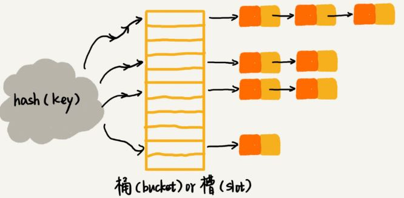
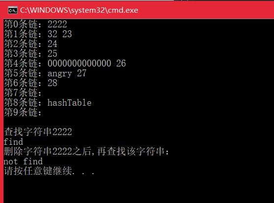

# <center>  散列表(哈希表)  </center>

---  
<font size=4>  

#1.实现一个基于链表法解决冲突问题的散列表  

**1.1 散列思想：散列用的是数组支持按照下标随机访问数据的特性，所以散列表就是数组的一种扩展，由数组演化而来。**  下面举例说明:  
假如我们有 89 名选手参加学校运动会。为了方便记录成绩，每选手胸前都会贴上自己的参赛号码。这 89 名选手的编号依次是051101,051102...其中，前两位 05 表示年级，中间两位 11 表示班级，最后两位是原来的编号1~89。现在希望编程实现这样一个功能，通过编号快速找到对应的选手信息？  
**思路**  ：截取参赛编号的后两位作为数组下标，来存取选手信息数据。当通过参赛编号查询选手信息时，用同样的方法取参赛选手编号的后两位，作为数组下标，来读取数组中的数据。  
其中，参赛选手的编号叫做**键(key)** ，把参赛编号转化为数组下标的映射方法叫做**散列函数(hash函数)** ，而散列函数计算得到的值就是 **散列值(hash值)** 。  

**1.2 散列函数设计的基本要求：**  

- 散列函数计算得到的散列值是一个非负整数；  
- 如果key1=key2，那hash(key1)=hash(key2);  
- 如果key1≠key2，那hash(key1)≠hash(key2)。  
第三点要求看似合情合理，但是在真实的情况下，要想找到一个不同的key对应的散列值都不一样的散列函数，几乎是不可能的。即使像业界著名的[MD5](https://zh.wikipedia.org/wiki/MD5)、[SHA](https://zh.wikipedia.org/wiki/SHA%E5%AE%B6%E6%97%8F)、[CRC](https://zh.wikipedia.org/wiki/%E5%BE%AA%E7%92%B0%E5%86%97%E9%A4%98%E6%A0%A1%E9%A9%97)也无法完全避免散列冲突。  

**1.3 散列冲突解决方法有两类：开放寻址(open addressing)和链表法(chaining)**  

**1.3.1 开放寻址法：**  如果出现散列冲突，就重新探测一个空闲位置，将其插入，那么重新探测新的位置，又分为线性探测(Linear Probing)、二次探测(Quadratic probing)和双重散列(Double hashing)  
- 线性探测：往散列表中插入数据时，若某个数据经过散列函数散列后，存储位置已经被占用，那就从当前位置开始一次往后查找，看是否有空的位置，直到找到为止；查找元素时，通过散列函数求出要查找元素的键值对应的散列值，然后比较数组中下标为散列值的元素和要查找的元素，如果相等，则说明是我们要找的元素，否则顺序往后查找，若遍历到数组中的空闲位置还没找到，则说明要查找的元素不在散列表中。  
- 二次探测：线性探测每次探测的步长为q，那它探测的下标序列就是hash(key)+0,hash(key)+1,hash(key)+2....而二次探测的步长变成了原来的二次方，它探测的下表序列为hash(key)+0,hash(key)+1^2,hash(key)+2^2....  
- 双重散列：使用一组散列函数hash1(key),hash2(key),hash3(key)...首先用第一个散列函数，如果计算得到的存储位置已被占用，再用第二个散列函数，依次类推，直到找到空闲的存储位置。  

**1.3.2 链表法：**  相比于开放寻址法，链表法要简单得多，在散列表中，每个槽位会对应一条链表，所有散列值相同的元素我们都放到相同槽位对应的链表中。  
  

- 插入时，只需要通过散列函数计算出对应的散列槽位，将其插入到链表中即可，所有插入的时间复杂度为O(1);  
- 查找、删除时，同样根据散列函数计算出对应的槽，然后遍历链表查找或删除 ，时间复杂度和链表长度k有关，即O(K),对于散列比较均匀的散列函数来说，k=n/m，其中n为散列中数据的个数，m表示散列表中槽的个数。  

**1.4 代码实现：** 包括构造哈希表、释放哈希表、在哈希表中查找、插入、删除。链表节点用双向链表实现。  

```

	#include <iostream>
	#include <vector>
	#include <string.h>
	using namespace std;
	#define N 10 //hash链表的数量
	typedef struct hash_node{
		char ch_value[100];
		struct hash_node *pre;//指向上一个结点指针
		struct hash_node *cur;//每个hash_table[k]的尾指针
		//没有该指针，每次插入到对应的链都要从头到尾遍历，加入该指针，可解决循环冲突链表的问题
		struct hash_node *next;//指向下一个节点
	
	}hashNode;
	//初始化哈希表
	hashNode** initHashTable(){
		hashNode **hashTab = (hashNode**)malloc(N*sizeof(hashNode));	
		for (int i = 0; i < N;i++)
		{
			hashTab[i] = nullptr;
		}
		return hashTab;
	}
	//定义hash函数，这里用字符串ASCII来哈希
	int hashFun(const char* ch){
		int sum = 0;
		for (int i = 0; i < strlen(ch); i++)
		{
			sum += ch[i];
		}
		return sum%N;
	}
	//插入数据
	void insertHashTable(const char* ch,hashNode** hashTab){
		int key = hashFun(ch);
		hashNode* ptr_new = (hashNode*)malloc(sizeof(hashNode));
		strcpy_s(ptr_new->ch_value, ch);
		ptr_new->pre = nullptr;
		ptr_new->next = nullptr;
		ptr_new->cur = nullptr;
	
		hashNode *ptr_head = hashTab[key];
		if (ptr_head==nullptr){
			hashTab[key] = ptr_new;
			hashTab[key]->cur = ptr_new;
		}
		else{
			hashTab[key]->cur->next = ptr_new;
			ptr_new->pre = hashTab[key]->cur;
			hashTab[key]->cur = ptr_new;
		}
	}
	//查找函数
	hashNode* findHashTable(const char* ch,hashNode** hashTab){
		int key = hashFun(ch);
		hashNode* ptr_new = hashTab[key];
		if (ptr_new == nullptr) return nullptr;
		while (ptr_new!=nullptr)
		{
			int res = strcmp(ptr_new->ch_value, ch);
			if (res == 0) return ptr_new;
			ptr_new = ptr_new->next;
		}
		return nullptr;
	}
	//释放哈希表每条链
	void freeHashTable(hashNode** hashTab){
		hashNode* ptr_move;
		for (int i = 0; i < N;i++)
		{
			ptr_move = hashTab[i];
			while (ptr_move != nullptr)
			{
				hashNode *del = ptr_move;
				ptr_move = ptr_move->next;
				free(del);
				del = nullptr;
			}
		}
	}
	//删除函数
	int deleteHashTable(const char* ch,hashNode** hashTab){
		int key = hashFun(ch);
		hashNode* ptr_new = hashTab[key];
		hashNode* ptr_tmp = findHashTable(ch, hashTab);
		if (hashTab[key]==nullptr||ptr_tmp==nullptr)
		{
			cout << "error!"; return 0;
		}
		if (ptr_tmp!=nullptr)
		{
			if (ptr_new==ptr_tmp)//该链只有一个元素
			{
				hashTab[key] = ptr_tmp->next;
				free(ptr_tmp);
				ptr_tmp = nullptr;
			}
			else{
				//从链中查找要删除的节点
				while (ptr_new->next!=ptr_tmp)
				{
					ptr_new = ptr_new->next;
				}
				ptr_new->next = ptr_tmp->next;
				free(ptr_tmp);
				ptr_tmp = nullptr;
				hashTab[key]->cur = ptr_new;
				ptr_new->next = nullptr;
				ptr_new->cur = nullptr;
			}
		}
	}
	//打印每条链上的数据
	void printHashTable(hashNode** hashTab){
		for (int i = 0; i < N;i++)
		{
			hashNode* ptr_tmp = hashTab[i];
			cout << "第" << i << "条链：";
			if (ptr_tmp!=nullptr)
			{
				while (ptr_tmp!=nullptr)
				{
					cout << ptr_tmp->ch_value<<" ";
					ptr_tmp = ptr_tmp->next;
				}
			}
			cout << endl;
		}
	}
	int main(){
		hashNode** hashTab = initHashTable();
		insertHashTable("0000000000000", hashTab);
		insertHashTable("angry", hashTab);
		insertHashTable("2222", hashTab);
		insertHashTable("hashTable", hashTab);
		insertHashTable("32", hashTab);
		insertHashTable("23", hashTab);
		insertHashTable("24", hashTab);
		insertHashTable("25", hashTab);
		insertHashTable("26", hashTab);
		insertHashTable("27", hashTab);
		insertHashTable("28", hashTab);
		printHashTable(hashTab);
	
		cout << "\n查找字符串2222" << endl;
		if (findHashTable("2222",hashTab)!=nullptr)
			cout << "find\n";
		else cout << "not find\n";
		deleteHashTable("2222", hashTab);
		cout << "删除字符串2222之后,再查找该字符串：" << endl;
		if (findHashTable("2222", hashTab) != nullptr)
			cout << "find\n";
		else cout << "not find\n";
		return 0;
	}

```  

**运行结果**  
  

#2.实现一个LRU缓存淘汰算法   
LRU是Least Recently Used，最近最少使用的意思。   
**2.1 引入散列表实现**  
　　(1)这个缓存器主要有两个成员函数，get和put，其中get函数是通过输入key来获取value，如果成功获得，这对(key,value)升至缓存器中最常用的位置(顶部)，如果key不存在，则返回-1；  
　　(2)put函数是插入一对新的(key,value),如果原缓存区中含有该key，则需要删除掉原有的，将新的插入到缓存器的顶部。如果不存在，直接插入到顶部。若插入新的值后缓存器超过了容量，则需要删掉一个最不常用的值，即底部的值；  
　　(3)具体实现时，需要三个私有变量，cap、l和m，cap是缓存器的容量，l是保存缓存器内容的列表，m是HashMap，保存关键值key和缓存器各项迭代器之间映射，方便我们以O(1)的时间内找到目标项；  
　　(4)get相对简单些，在m中查找给定的key，若不存在直接返回-1，若存在将此项移到顶部，这里使用C++STL中的函数splice，专门移动链表中的一个或若干个节点到特定的位置，这里我们只需移动key对应的迭代器到列表的开头，然后返回value。    
　　(5)解释一下为什么HashMap不用更新，因为HashMap的建立是关键值key和缓存列表中的迭代器之间的映射，get函数是查询函数，如果关键值key不在HashMap，那么不需要更新，如果在，需要更新的是该key-value对在缓存列表中的位置，而HashMap中还是这个key跟键值对的迭代器之间的映射，因此并不需要更新什么；   
　　(6)put函数，也是先在m中查找给定的key，如果存在就删掉原有项，并在顶部插入新来项，然后判断是否溢出，若溢出则删掉底部项。  
```

	class LRUCache {
	public:
	    LRUCache(int capacity) {
	        cap=capacity;
	    }
	    
	    int get(int key) {
	        auto it=m.find(key);
	        if(it==m.end()) return -1;
	        l.splice(l.begin(),l,it->second);
			//it指m的迭代器，it->second指list的迭代器,it->second->second指list中pair对组的第二个元素
	        return it->second->second;
	    }
	    
	    void put(int key, int value) {
	        auto it=m.find(key);
	        if(it!=m.end()) l.erase(it->second);
	        l.push_front(make_pair(key,value));
	        m[key]=l.begin();
	        if(m.size()>cap){
	            int k=l.rbegin()->first;
	            l.pop_back();
	            m.erase(k);
	        }
	    }
	private:
	    int cap;
	    list<pair<int,int>> l;
	    unordered_map<int,list<pair<int,int>>::iterator> m;
	};

```

**2.2 使用双向链表+map实现：**  采用双向链表的原因：若用单链表，删除节点的时候需要从表头开始遍历查找，效率为O(n)，采用双向链表可以直接改变节点的前去指针指向并进行删除达到O(1)的效率。使用map保存节点的key和value值便于能在O(logn)的时间查找元素，对应get操作。    
```

	#include <iostream>
	#include <map>
	using namespace std;
	/*
	**definition oa cachelist node,it's a double linked list node.
	*/
	struct CacheNode
	{
		int key, value;
		struct CacheNode *pre, *next;
		CacheNode(int k, int v) :key(k), value(v), pre(nullptr), next(nullptr){ }
	};
	class LRUCache
	{
	private:
		int size;//Maximum of Cachelist size
		CacheNode *head, *tail;
		map<int, CacheNode*> mp;
	public:
		LRUCache(int capacity){
			size = capacity;
			head = nullptr;
			tail = nullptr;
		}
		~LRUCache(){}
	
		int get(int key){
			map<int, CacheNode*>::iterator it = mp.find(key);
			if (it!=mp.end())
			{
				CacheNode *node = it->second;
				remove(node);
				setHead(node);
				return node->value;
			}
			else
			return -1;
		}
		void put(int key,int value){
			map<int, CacheNode*>::iterator it= mp.find(key);
			if (it!=mp.end())
			{
				CacheNode *node = it->second;
				node->value = value;
				remove(node);
				setHead(node);
			}
			else{
				CacheNode *newNode = new CacheNode(key, value);
				if (mp.size()>=size)
				{
					map<int, CacheNode*>::iterator it = mp.find(tail->key);
					remove(tail);
					mp.erase(it);
				}
				setHead(newNode);
				mp[key] = newNode;
			}
		}
		void remove(CacheNode* node){
			if (node->pre != nullptr)
				node->pre->next = node->next;
			else
				head = node->next;
			if (node->next != nullptr)
				node->next->pre = node->pre;
			else
				tail = node->next;
		}
		void setHead(CacheNode *node){
			node->next = head;
			node->pre = nullptr;
			if (head != nullptr)
				head->pre = node;
			head = node;
			if (tail == nullptr)
				tail = head;
		}
	};
	
	
	int main(){
		LRUCache *lruCache = new LRUCache(3);
		lruCache->put(1, 2);
		lruCache->put(11, 22);
		lruCache->put(111, 222);
		cout << lruCache->get(1) << endl;//输出2
		lruCache->put(1111, 2222);
		cout << lruCache->get(111) << endl;//输出222
		cout << lruCache->get(1) << endl;//输出-1
		return 0;
	}

```

</front>