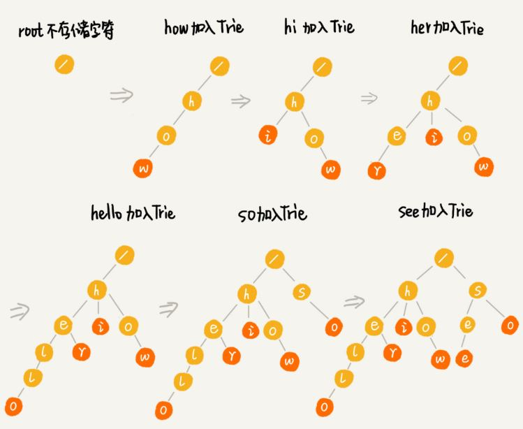
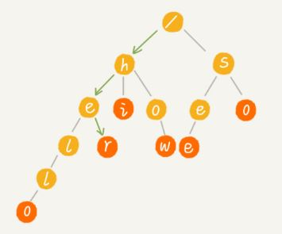
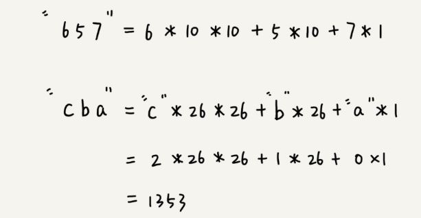

# <center>  字符串  </center>

---  
<font size=4>  
#1.实现一个字符集，只包含a~z这26个英文字母的Trie树  

**1.1 什么是Trie树:** 它是一个树形结构，也称前缀树或单词查找树，是一种专门处理字符串匹配的数据结构，用来解决在一组字符串集合中快速查找某个字符串的问题。  
**Trie树的本质，就是利用字符串之间的公共前缀，将重复的前缀合并在一起。**  如下图，构造过程的每一步，都相当于往Trie树中插入一个字符串，当所有字符串都插入完成之后，Trie树就构造好了。  
  
当在Trie数中查找一个字符串时，如查找"her"，那么就将要查找的字符串分割成单个的字符h,e,r，然后从Trie树的根节点开始匹配，如下图，绿色路径就是在Trie树中匹配的路径。  
  

**1.2 Trie树性质及操作:** 字典树主要有如下三点性质：  
- 根节点不包含字符，出根节点外每个节点只包含一个字符；  
- 从根节点到某个节点，路径上经过的字符连接起来，为该节点对应的字符串；  
- 每个节点的所有子节点包含的字符串不同。   
　　字典树的插入、删除和查找都不是很难，用一个循环即可，即第i次循环找到前i个字母所对应的子树，然后进行相应的操作。实现一棵字典树，用最常见的数组保存(静态开辟内存)即可，当然也可以开动态的指针类型(动态开辟内存)；至于节点对儿子的指向，一般有三种方法：  
1)对每个节点开一个字母集大小的数组，对应的下标是儿子所表示的字母，内容则是这个儿子对应在大叔组上的位置，即标号；  
2)对每个节点挂一个链表，按一定顺序记录每个儿子是谁；  
3)使用左儿子右兄弟表示法记录这棵树。  
以上，地中易实现，但实际空间要求较大；第二种易实现，空间要求小，但费时；第三种空间要求小但相对费时且不易写。  

**1.3 实现思路:**  根据第一种实现方法，字母的字典树每个节点要定义一个大小为26的子节点指针数组，然后用一个标识符来记录到当前位置为止是否为一个词，初始化的时候将26个子节点都赋为空。那么insert操作只需要对要插入的字符串的每一个字符算出其位置，然后找是否存在这个子节点，若不存在则新建一个，然后再查找下一个字符。查找词和找前缀操作跟insert操作很类似，不同点在于若不存在子节点，则返回false。查找词最后还要看标志位，而找前缀直接返回true即可，代码如下：  
```

	class TrieNode{
	public:
	    TrieNode *child[26];
	    bool isWord;
	    TrieNode():isWord(false){
	        for(auto &a : child) a=nullptr;
	    }
	};
	class Trie {
	public:
	    /** Initialize your data structure here. */
	    Trie() {
	        root=new TrieNode();
	    }
	    
	    /** Inserts a word into the trie. */
	    void insert(string word) {
	        TrieNode *p=root;
	        for(auto &a:word){
	            int i=a-'a';
	            if(!p->child[i]) p->child[i]=new TrieNode();
	            p=p->child[i];
	        }
	        p->isWord=true;
	    }
	    
	    /** Returns if the word is in the trie. */
	    bool search(string word) {
	        TrieNode *p=root;
	        for(auto &a :word){
	            int i=a-'a';
	            if(!p->child[i]) return false;
	            p=p->child[i];
	        }
	        return p->isWord;
	    }
	    
	    /** Returns if there is any word in the trie that starts with the given prefix. */
	    bool startsWith(string prefix) {
	        TrieNode *p=root;
	        for(auto &a : prefix){
	            int i=a-'a';
	            if(!p->child[i]) return false;
	            p=p->child[i];
	        }
	        return true;
	    }
	private:
	    TrieNode* root;    
	};

```

#2.实现朴素的字符串匹配算法    

　　字符串匹配算法有很多，比较简单、好理解的有BF和Rk算法(是BF的改进)，较难理解、但更高效的有BM和KMP算法。  
**2.1 BF(brute Force)算法** ：暴力匹配算法，也叫朴素匹配算法。  
(1) 理解主串和模式串：比如在字符串A中查找字符串B，那字符串A就是主串，字符串B就是模式串。我们把主串的长度记为n，模式串的长度即为m，因为实在主串中查找模式串，因此n>m.  
(2) 理解BF思想：**在主串中，检查起始位置分别是0、1、2...n-m且长度为m的n-m+1个子串，看有没有跟模式串匹配的。**  
(3)最坏情况时间复杂度：在极端情况下，比如主串为"aaaaaa.....aaaab"，模式串是"aaaab"。我们每次都比对m个字符，要比较n-m+1次，所有，这种算法的最坏情况时间复杂度为O(n*m)。  
　　尽管理论上BF算法的时间复杂度很高，但实际开发中，它却是一个比较常用的字符串匹配算法。第一点原因：实际的软件开发中，大部分子串和模式串都不会太长，而且每次模式串与主串中的字串匹配时，当中途遇到不能匹配的字符的时候就会停止，不需要把m个字符都比较一下。第二点BF算法思想简单，代码实现也简单，不易出错。  
```

	//返回字串在主串中的位置
	int bf(string &main, string &pattern){
		int n = main.size();
		int m = pattern.size();
		if (n < m) return -1;
		else if (n == m) return 0;
		for (int i = 0;i<(n-m+1);i++)
		{
			for (int j = 0; j < m;j++)
			{
				if (main[i + j] == pattern[j]){
					if (j == m - 1)  return i;
				}else 
					break;
			}
		}
		return -1;
	}
	
	int main(){
		string main = "abdcabcdefg";
		string pattern = "abcde";
		cout << bf(main, pattern);//输出为4
		return 0;
	}

```

**2.2 RK(Rabin-Karp)算法** ：是由它的两位发明者Rabin和Karp的名字来命名。该算法是对朴素匹配算法进行改造，引入哈希算法。  
(1)RK思路：**通过哈希算法对n-m+1个子串分别求哈希值，然后逐个与模式串的哈希值比较大小。如果某个子串的哈希值与模式串相等，则说明对应的子串和模式串匹配(暂不考虑哈希冲突的问题).**   
不过，通过哈希算法计算子串的哈希值的时候，需要遍历子串中的每个字符。尽管模式串与子串比较的效率提高了，但是算法整体的效率并没有提高！！！为解决这个问题，就需要哈希算法设计的技巧了。  
>假设要匹配的字符串的字符集只包含k个字符，我们可以用一个k进制来表示一个子串，这个k进制数转化成十进制数，作为子串的哈希值。  
**比如要处理的字符串只包含a-z这26个小写字母，那我们就用二十六进制来表示一个字符串，把a-z这26个字符映射到0-25这26个数字，a就表示0，b就表示1等等。**  
在十进制的表示法中,一个数字的值是通过下面的方式计算处理啊的,对应到二十六进制,一个包含a-z这26个字符的字符串,计算哈希的时候,只需要把进位从10改成26就可以.  

  


</front>