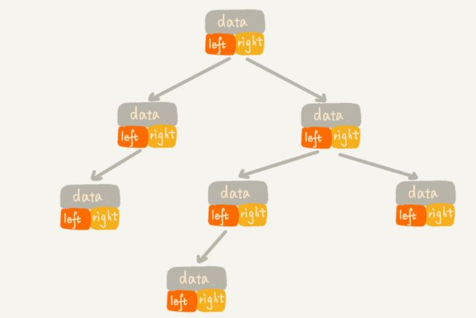
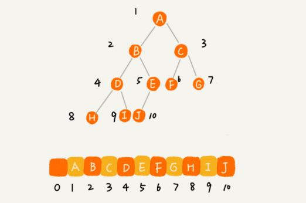

# <center>  二叉树  </center>

---  
<font size=4>  

## 1.实现一个二叉查找树，并且支持插入、删除、查找操作   
**1.1 相关概念：**  

- 数里面的每个元素我们叫作"节点"；用来连线相邻节点之间的关系，叫作"父子关系"；  
- 节点又分为父节点、子节点、兄弟节点，没有父节点的根节点、没有子节点的叶子节点或叶节点；  
- 下面区分三个比较相似的概念：高度、深度、层  
节点的高度=节点到叶子节点的最长路径(变数)；  
节点的深度=根节点到这个节点所经历的边的个数；  
节点的层数=节点的深度+1；  
树的高度=根节点的高度。  

**1.2 二叉树：**  
　　叶子节点全都在最底层，除了叶子节点外每个节点都有左右两个子节点，这种二叉树叫作**满二叉树** 。叶子节点都在最底下两层，最后一层的叶子节点都靠左排列，并且除了最后一层，其他层的节点个数都要达到最大，这种二叉树叫做**完全二叉树**  。    
　　想要存储一棵二叉树，有两种方法，一种是基于指针或引用的二叉链式存储法，一种是基于数组的顺序存储法。  
(1)链式存储法：每个节点都三个字段，其中一个存储数据，另外两个指向左右子节点的指针。这种存储方式比较常用，大部分二叉树代码都是通过这种结构来实现的。  
<div align="center"></div>  
(2)顺序存储法：把根节点存储在下标i=1的位置；把节点X存储在数组中小标为i的位置，下标为2*i的位置存储的是左子节点，下标为2*i+1的位置存储的就是右子节点；反过来，下标为i/2的位置存储的就是它的父节点。  
<div align="center"> </div>   
**1.3 二叉查找树：**  其最大的特点就是，支持动态数据集合的快速插入、删除和查找操作。  
　　**二叉查找树要求，在树的任意一个节点，其左子树中的每个节点的值都要小于这个节点的值，其右子树的值都大于这个节点的值。**  
(1)二叉查找树的查找操作  
查找一个节点，先取根节点，若它等于要查找的数就返回；若要查找的树比根节点小，那就在左子树中递归查找；若要查找的数比根节点大，就在右子树中递归查找。  
(2)二叉查找树的插入操作  
新插入的数据一般都是在叶子节点上，所以只需要从根节点开始，一次比较要查插入的数据和节点的大小关系。  
如果要插入的数据比根节点的数据大，并且节点的右子树为空，就将数据直接插入到右子节点的位置；如果不为空，就再递归遍历右子树，查找插入位置；同理若要插入的数据比节点值小，并且节点的左子树为空，就将新数据直接插入做节点，若不为空，就再递归遍历左子树，查找插入位置。  
(3)二叉查找树的删除操作  
根据要删除节点的子节点个数的不同，需要分三种情况来处理：  
>第一种，如果要删除的节点没有子节点，只需将父节点中指向要删除节点的指针置为null；  
>第二种，要删除的节点只有一个子节点(只有左子节点或右子节点)，只需要更新父节点中，指向要删除节点的指针，让他指向要删除节点的子节点就可以了；  
>第三种，如果要删除的节点有两个节点，较复杂，需要找到这个节点的右子树中的最小节点，把它替换到要删除的节点上，再删除掉这个最小节点，因为最小节点肯定没有左子节点(如果有左子节点，那就不是最小节点了),所以，我们可以应用上面两条规则来删除这个最小节点。  

```
	
	#include <iostream>
	using namespace std;
	typedef int DataType;
	struct treeNode{
		DataType data;
		struct treeNode *left = nullptr, *right = nullptr;
	};
	class binarySearchTree{
	private:
		treeNode* root;
		int num;
	public:
		binarySearchTree() :num(0){
			root = new treeNode;
			root->left = nullptr;
			root->right = nullptr;
		}
		//递归实现查找
		bool find(DataType it, treeNode *root){
			if (root == nullptr) return false;
	
			if (root->data == it) return true;
			else if (it > root->data)
				return find(it, root->right);
			else
				return find(it, root->left);
		}
		bool findData(DataType it){
			return find(it, root);
		}
		//非递归实现插入
		void insert(DataType it){
			if (num == 0){
				root->data = it;
				num++;
				return;
			}
			treeNode *p = root;
			while (p != nullptr)
			{
				if (it < p->data)
				{
					if (p->left==nullptr)
					{
						p->left = new treeNode;
						p->left->data = it;
						num++;
						return;
					}
					p = p->left;
				}
				else{//若等于该节点，则插入右边
					if (p->right==nullptr)
					{
						p->right = new treeNode;
						p->right->data = it;
						num++;
						return;
					}
					p = p->right;
				}
			}
		}
		void delet(DataType it){
			if (root == nullptr) return;
			treeNode *p = root;
			treeNode *pp = nullptr;//pp记录p的父节点
			while (p!=nullptr&&p->data!=it)
			{
				pp = p;
				if (it < p->data) p = p->left;
				else
					p = p->right;
			}
	
			if (p == nullptr) { cout << "not find the data you want to delete\n"; return; }//没找到
			//删除的节点有两个子节点
			if (p->left&&p->right)
			{
				treeNode *minp = p->right;
				treeNode *minpp = p;//记录p的父节点
				while (minp->left!=nullptr)//寻找右子树最小节点
				{
					minpp = minp;
					minp = minp->left;
				}
				p->data = minp->data;//将minp替换到p上
				//将p换到叶节点上，使用叶节点方法进行删除,继续执行下面的删除叶节点操作
				p = minp;
				pp = minpp;
			}
	
			//删除节点是叶节点或者仅有一个节点
			treeNode* child;
			if (p->left != nullptr) child = p->left;
			else if (p->right != nullptr) child = p->right;
			else child = nullptr;
			if (pp == nullptr) root = child;//删除的是根节点
			else if (p == pp->left) pp->left = child;
			else pp->right = child;
			delete p;//回收节点内存
		}
	};
	int main(){
		binarySearchTree myTree;
		myTree.insert(5);
		myTree.insert(4);
		myTree.insert(6);
		myTree.insert(10);
		myTree.insert(3);
		myTree.insert(8);
		myTree.insert(1);
		if (myTree.findData(3)) cout << "find\n";
		else cout << "not find\n";
	
		myTree.delet(3);
		
		if (myTree.findData(3)) cout << "find\n";
		else cout << "not find\n";
	
		return 0;
	}

```

## 2.实现查找二叉树中某个节点的后继、前驱结点  

```

		DataType getPreNode(DataType it){
			if (root == nullptr) return -1;
			if (it == root->data) return  -1;
			treeNode *p = root;
			treeNode *pp = nullptr;
			while (p->data!=it && p!=nullptr)
			{
				pp = p;
				if (it < p->data) p = p->left;
				else p = p->right;
			}
			return (p == nullptr) ? -1 : pp->data;
		}
		DataType getPostNode(DataType it){
			if (root == nullptr) return -1;
			treeNode *p = root;
			while (it!=p->data && p!=nullptr)
			{
				if (it < p->data) p = p->left;
				else p = p->right;
			}
			if (p == nullptr) return -1;
			else if (p->left != nullptr) return p->left->data;
			else if (p->right != nullptr) return p->right->data;
			else return -1;
		}

```

## 3.实现二叉树前、中、后序以及按层遍历  
**3.1 递归遍历**  

```

	/**
	 * Definition for a binary tree node.
	 * struct TreeNode {
	 *     int val;
	 *     TreeNode *left;
	 *     TreeNode *right;
	 *     TreeNode(int x) : val(x), left(NULL), right(NULL) {}
	 * };
	 */
	//先序遍历  
	class Solution {
	public:
	    vector<int> preorderTraversal(TreeNode* root) {
	        vector<int> res;
	        preorder(root,res);
	        return res;
	    }
	private:
	    void preorder(TreeNode *root,vector<int>& res){
	        if(root){
	            res.push_back(root->val);
	            preorder(root->left,res);
	            preorder(root->right,res);
	        }      
	    }
	};
	//中序遍历
	class Solution {
	public:
	    vector<int> inorderTraversal(TreeNode* root) {
	        vector<int> res;
	        inorder(root,res);
	        return res;
	    }
	private:
	    void inorder(TreeNode *root,vector<int>& res){
	        if(root){
	            inorder(root->left,res);
	            res.push_back(root->val);
	            inorder(root->right,res);
	        }      
	    }
	};
	//后序遍历
	class Solution {
	public:
	    vector<int> postorderTraversal(TreeNode* root) {
	        vector<int> res;
	        postorder(root,res);
	        return res;
	    }
	private:
	    void postorder(TreeNode *root,vector<int>& res){
	        if(root){
	            postorder(root->left,res);
	            postorder(root->right,res);
	            res.push_back(root->val);
	        }      
	    }
	};

```

**3.2 非递归遍历** 用到stack来辅助运算。  
(1.1)先序遍历“根-左-右”： i.把根节点push到栈中；ii.循环检测栈是否为空，若不空，则取出栈顶元素，保存其值，然后看其右子节点是否存在，若存在则push到栈中；再看其左子节点，若存在，则push到栈中。  
```

	class Solution {
	public:
	    vector<int> preorderTraversal(TreeNode* root) {
	        if(root==NULL) return {};
	        vector<int> res;
	        stack<TreeNode*> s{{root}};
	        while(!s.empty()){
	            TreeNode* p=s.top(); s.pop();
	            res.push_back(p->val);
	            if(p->right) s.push(p->right);
	            if(p->left) s.push(p->left);
	        }
	        return res;
	    }
	};
```  
(1.2)先序遍历:这种写法使用了一个辅助节点，可看作一个模板，对应的还有中序和后续，形式很统一。辅助节点p初始化为root，while循环的条件是栈不为空或辅助节点p不为空，在循环中首先判断如果辅助节点不为空，就先将p压入栈，然后将p的节点值加入结果，此时p指向其左子节点；否则如果p不存在的话说明没有子节点，我们取出栈顶节点，将p指向栈顶节点的右子节点。  

```

	class Solution {
	public:
	    vector<int> preorderTraversal(TreeNode* root) {
	        if(root==NULL) return {};
	        vector<int> res;
	        stack<TreeNode*> s;
	        TreeNode *p=root;
	        while(p || !s.empty()){
	           if(p){
	               res.push_back(p->val);
	               s.push(p);
	               p=p->left;
	           }else{
	               TreeNode *t=s.top(); s.pop();
	               p=t->right;
	           }
	        }
	        return res;
	    }
	};
```

(2.1)中序遍历“左-根-右”：从根节点开始，先将根节点压栈，然后再将其所有左子节点压入栈，然后取出栈顶元素，保存结点值，再将当前指针移到其右子节点上，若存在右子节点，则在下次循环时又可将其所有左子节点压入栈中。  
```

	class Solution {
	public:
	    vector<int> inorderTraversal(TreeNode* root) {
	        vector<int> res;
	        stack<TreeNode*> s;
	        TreeNode *p=root;
	        while(p || !s.empty()){
	            while(p){
	                s.push(p);
	                p=p->left;
	            }
	            p=s.top(); s.pop();
	            res.push_back(p->val);
	            p=p->right;
	        }
	        return res;
	    }
	};
```
(2.2)该解法和(1.2)解法一样，只是把节点值加入结果的步骤从if中移到了else中。  
```

	class Solution {
	public:
	    vector<int> inorderTraversal(TreeNode* root) {
	        vector<int> res;
	        stack<TreeNode*> s;
	        TreeNode *p = root;
	        while (!s.empty() || p) {
	            if (p) {
	                s.push(p);
	                p = p->left;
	            } else {
	                p = s.top(); s.pop();
	                res.push_back(p->val);
	                p = p->right;
	            }
	        }
	        return res;
	    }
	};
```

(3.1)后序遍历：由于后续遍历的顺序是左右根，而先序遍历的顺序是根左右，二者其实很相近，可以在(1.1)的基础上做些小改动,使其遍历顺序为根右左，然后翻转，就是左右根了。翻转的方法就是反向加入res，每次都在结果res的开头加入节点值。  

```

	class Solution {
	public:
	    vector<int> postorderTraversal(TreeNode* root) {
	        if (!root) return {};
	        vector<int> res;
	        stack<TreeNode*> s{{root}};
	        while (!s.empty()) {
	            TreeNode *t = s.top(); s.pop();
	            res.insert(res.begin(), t->val);
	            if (t->left) s.push(t->left);
	            if (t->right) s.push(t->right);
	        }
	        return res;
	    }
	};
```
(3.2)方法同(1.2)(2.2),但同样也要经过反转实现。    

```
	class Solution {
	public:
	    vector<int> postorderTraversal(TreeNode* root) {
	        vector<int> res;
	        stack<TreeNode*> s;
	        TreeNode *p=root;
	        while(p || !s.empty()){
	            if(p){
	                s.push(p);
	                res.insert(res.begin(),p->val);
	                p=p->right;
	            }else{
	                TreeNode *t=s.top(); s.pop();
	                p=t->left;
	            }    
	        }
	        return res;
	    }
	};

```
## 4.完成LeetCode上的验证二叉搜索树(98)、二叉树层次遍历(102、107)
**4.1 Validate Binary Search Tree:**  该题目设定为一般情况下左<根<右，那么就可以直接用中序遍历来做。通过中序遍历将所有的节点值保存到一个数组中，然后再判断该数组是否有序。  
```

	class Solution {
	public:
	    bool isValidBST(TreeNode* root) {
	        if(root==NULL) return true;
	        vector<int> res;
	        inorder(root,res);
	        for(int i=0;i<res.size()-1;i++){
	            if(res[i]>=res[i+1]) return false;
	        }
	        return true;
	    }
	private:
	    void inorder(TreeNode* root,vector<int> &res){
	        if(root){
	            inorder(root->left,res);
	            res.push_back(root->val);
	            inorder(root->right,res);
	        }
	    }    
	};
```

**4.2 Binary Search Tree Level Order Traversal(102):**  该题是典型的广度优先搜索BFS的应用，但是这里还需注意的是把搜索树的每一层分开，村到一个二维向量里面，大体思路是这样：建立一个queue，然后把根节点放进去，这时找根节点的左右两个子节点，去掉根节点，此时queue里的元素就是下一层的所有节点，用一个for循环遍历它们，然后存到一个一维向量里面，遍历完之后再把这个一维向量存到二位向量里面，以此类推。  
```

	class Solution {
	public:
	    vector<vector<int>> levelOrder(TreeNode* root) {
	        if(root==NULL) return {};
	        vector<vector<int>> res;
	        queue<TreeNode*> q{{root}};
	        while(!q.empty()){
	            vector<int> oneLevel;
	            for(int i=q.size();i>0;i--){
	                TreeNode *t=q.front();q.pop();
	                oneLevel.push_back(t->val);
	                if(t->left) q.push(t->left);
	                if(t->right) q.push(t->right);
	            }
	            res.push_back(oneLevel);
	        }
	        return res;
	    }
	};

```

**递归求法(深度优先搜索求解)：**  核心在于需要一个二维数组和一个变量level，在leetcode上递归要比使用queue速度快些，代码如下：  
```

	class Solution {
	public:
	    vector<vector<int>> levelOrder(TreeNode* root) {
	        if(root==NULL) return {};
	        vector<vector<int>> res;
	        levelorder(root,0,res);
	        return res;
	    }
	    void levelorder(TreeNode *node,int level,vector<vector<int>> &res){
	        if(node==NULL) return;
	        if(res.size()==level) res.push_back({});
	        res[level].push_back(node->val);
	        levelorder(node->left,level+1,res);
	        levelorder(node->right,level+1,res);
	    }
	};
```

**4.3 Binary Search Tree Level Order Traversal(107):**  
**(1) 广度优先搜索BFS:** 从底部层序遍历，其实还是从底部开始遍历，只不过最后存储的方式有所改变。  
```

	class Solution {
	public:
	    vector<vector<int>> levelOrderBottom(TreeNode* root) {
	        if(root==NULL) return {};
	        vector<vector<int>> res;
	        queue<TreeNode*> q{{root}};
	        while(!q.empty()){
	            vector<int> oneLevel;
	            for(int i=q.size();i>0;i--){
	                TreeNode *t=q.front();q.pop();
	                oneLevel.push_back(t->val);
	                if(t->left) q.push(t->left);
	                if(t->right) q.push(t->right);
	            }
	            res.insert(res.begin(),oneLevel);
	        }
	        return res;
	    }
	};
```

**(2) 深度优先搜索DFS:** 由于递归的特性，我们会一直深度优先去处理左子节点，那么势必会穿越不同的层，所以要加入某个节点时，必须要知道当前的深度，用level标记当前的深度，初始化带入0，表示根节点所在的深度。当level等于二维数组的大小的时候，访问res[level]时会报错的，需要申请一个空层，继续往里加数字。  
```

	class Solution {
	public:
	    vector<vector<int>> levelOrderBottom(TreeNode* root) {
	        if(root==NULL) return {};
		        vector<vector<int>> res;
		        levelorder(root,0,res);
		        return vector<vector<int>> {res.rbegin(),res.rend()};
		}
	    void levelorder(TreeNode *node,int level,vector<vector<int>> &res){
	        if(node==NULL) return;
	        if(res.size()==level) res.push_back({});
	        res[level].push_back(node->val);
	        levelorder(node->left,level+1,res);
	        levelorder(node->right,level+1,res);
	    }
	};
```

</front>