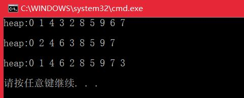

# <center>  堆  </center>

---  
<font size=4>  

## 1.实现一个小顶堆、大顶堆、优先级队列  
**堆，是一种完全二叉树。** 而且在这棵树中，大顶堆的父节点必然大于子节点，小顶堆的父节点必然小于子节点。由于堆是一种完全二叉树，很适合保存为数组的形式。在堆中，若父亲的索引为i，左儿子的索引为2*i，而右儿子的索引为2*i+1。  
小顶堆：树根元素为最小值往叶子递增；  
大顶堆：树根元素为最大值往叶子递减；  
**1.1 小顶堆：**  实现小顶堆是主要有两个操作，从下往上堆化(上浮)，用于插入数据；还有从上往下堆化(下沉)，用于删除堆顶元素。具体操作将在代码中进行注释。  
```

	#include <iostream>
	#include <vector>
	using namespace std;
	template<typename T>
	class minHeap{
	private:
		int capacity;
		int size;
		vector<T> data;
	public:
		minHeap(T buff[], int len);
		minHeap(int capacity);
		virtual ~minHeap();
		int getSize();
		bool isFull();
		bool isEmpty();
		void swap(vector<T> &vec, int i, int j);
		void floating(int index);
		void sink(int index);
		bool push(T dt);
		bool pop(int index);
		void print();
	};
	
	template<typename T>
	void minHeap<T>::print()
	{
		cout << "heap:";
		for (int i = 0; i < size;i++)
		{
			cout << data[i] << ' ';
		}
		cout << "\n\n";
	}
	
	/*删除元素
	**1.把堆的第index个元素删除，并把堆的最后一个元素放到index处；
	**2.把堆的第index个元素下沉。
	*/
	template<typename T>
	bool minHeap<T>::pop(int index)
	{
		if (isEmpty()) return false;
		data[index] = data[size - 1];
		size--;
		sink(index + 1);
	}
	/*
	**1.从根开始，用父节点与左子节点比较，若父节点大于左子节点，则交换它们的值；；
	**2.用父节点与右节点比较，若父节点大于右子节点，则交换它们的值。
	**3.若上述情况发生，则继续下沉，直到无法下沉为止
	*/
	template<typename T>
	void minHeap<T>::sink(int index)
	{
		int i = index;
		while (i*2<=size)
		{
			if (data[i - 1] > data[i * 2 - 1]){
				swap(data, i - 1, i * 2 - 1);
				if (i * 2 + 1 <= size&&data[i - 1] > data[i * 2])
					swap(data, i - 1, i * 2);
				i = i * 2;
			}
			else if (i * 2 + 1 <= size&&data[i - 1] > data[i * 2]){
				swap(data, i - 1, i * 2);
				i = i * 2 + 1;
			}
			else
				break;
		}
	}
	
	/*添加元素
	**1.把元素添加到堆的最后；
	**2.并使用上浮的方法把堆的最后一个元素上浮。
	*/
	template<typename T>
	bool minHeap<T>::push(T dt)
	{
		if (isFull()) return false;
		data[size] = dt;
		size++;
		floating(size);
	}
	
	/*
	**1.将堆中第index个元素与它的父亲比较，若小于父节点，则与它父亲交换数值；
	**2.上述过程如果发生，则把它继续上浮。
	*/
	template<typename T>
	void minHeap<T>::floating(int index)
	{
		for (int i = index; i > 0;i*=0.5)
		{
			if (data[i-1] < data[i*0.5-1])
				swap(data, i-1 , i* 0.5-1 );
			else
				break;
		}
	}
	
	template<typename T>
	void minHeap<T>::swap(vector<T> &vec, int i, int j)
	{
		T tmp = vec[i];
		vec[i] = vec[j];
		vec[j] = tmp;
	}
	
	template<typename T>
	bool minHeap<T>::isEmpty()
	{
		return size == 0;
	}
	
	template<typename T>
	bool minHeap<T>::isFull()
	{
		return size == capacity;
	}
	
	template<typename T>
	int minHeap<T>::getSize()
	{
		return size;
	}
	
	template<typename T>
	minHeap<T>::~minHeap()
	{
	
	}
	
	template<typename T>
	minHeap<T>::minHeap(int capacity)
	{
		this->capacity = capacity;
		size = 0;
		data.resize(capacity);
	}
	
	template<typename T>
	minHeap<T>::minHeap(T buff[], int len)
	{
		capacity = len;
		size = 0;
		data.resize(len);
		for (int i = 0; i < len; i++)
		{
			push(buff[i]);
		}
	
	}
	
	int main(){
		int buffer[10] = { 9, 8, 7, 6, 5, 4, 3, 2, 1, 0 };
		minHeap<int> heap(buffer, 10);
		heap.print();
		heap.pop(1);
		heap.print();
		heap.push(1);
		heap.print();
		return 0;
	}
```


  

## 2.实现堆排序(复习)   
```

	void heapify(vector<int> &A,int n,int i){//从上到下
		while (true)
		{
			int maxpos = i;
			if (i * 2 <= n&&A[i] < A[i * 2]) maxpos = i*2;
			if ((i * 2 + 1 )<= n&&A[maxpos] < A[i * 2 + 1]) maxpos = i * 2 + 1;
			if (maxpos==i) break;//满足父子节点关系，堆化完成
			swap(A[maxpos],A[i]);
			i = maxpos;
		}
	}
	void buildHeap(vector<int>& A,int  n){
		for (int i = n / 2; i >= 1;i--)
		{
			heapify(A, n, i);
		}
	}
	void heapSort(vector<int>& A,int n){
		buildHeap(A,n);
		int k = n;
		while (k>1)
		{
			swap(A[1], A[k]);
			k--;
			heapify(A, k, 1);
		}
	}
```

## 3.利用优先级队列合并K个有序数组    
**问题分析：** 给定K个有序数组，每个数组有n个元素，把这些数组合并为一个有序数组。  
**3.1 先合并后排序** 最简单的方法就是创建一个n*k大小的数组，然后把所有数字拷贝进去，再进行时间复杂度为O(nlogn)排序算法，这样总体的时间复杂度为O(nklog(nk))  
**3.2 利用小顶堆完成** 时间复杂度为O(nklogk)，实现流程如下：  
>1.创建一个大小为n*k的数组保存最后的结果；  
>2.创建一个大小为k的最小堆，堆中元素为k个数组中的每个数组的第一个元素;  
>3.重复下列步骤n*k次：  
>>- 每次从堆中取出最小元素(堆顶元素)，并将其存入输出数组中  
>>- 用堆顶元素所在数组的下一个元素将堆顶元素替换掉  
>>- 如果数组中元素被取光了，将堆顶元素替换为无穷大，每次替换堆顶元素后，重新调整堆  

```

	#include <iostream>	
	using namespace std;
	#define n 4
	struct MinHeapNode 
	{
		int element;//待排序元素
		int i;//数组索引，element是从哪个数组取得
		int j;//元素索引，下一个element
	};
	//定义一个最小节点之间的比较函数
	void swap(MinHeapNode *x, MinHeapNode *y){
		MinHeapNode t = *x; *x = *y; *y = t;
	}
	
	class MinHeap{
	private:
		MinHeapNode *hArr;//指向最小堆的堆顶元素
		int size;//堆大小
	public:
		MinHeap(MinHeapNode a[], int size);
		//调整堆 调整给定根节点的字数结构
		void MinHeapify(int i);
		//取堆顶元素
		MinHeapNode getMin(){
			return hArr[0];
		}
		//替换根节点，重新调整堆
		void replaceMin(MinHeapNode x){
			hArr[0] = x; MinHeapify(0);
		}
	};
	
	MinHeap::MinHeap(MinHeapNode a[], int size)
	{
		this->size = size;
		hArr = a;
		int i = (size - 1) / 2;
		while (i>=0)
		{
			MinHeapify(i);
			i--;
		}
	}
	void MinHeap::MinHeapify(int i)
	{
		//2*i+1左子节点下标  2*i+2为右子节点下标
		int minpos = i;
		if ((2 * i + 1) < size&&hArr[2 * i + 1].element < hArr[i].element) minpos = 2 * i + 1;
		if ((2 * i + 2) < size&&hArr[2 * i + 2].element < hArr[minpos].element) minpos = 2 * i + 2;
		if (i != minpos){
			swap(hArr[i], hArr[minpos]);
			MinHeapify(minpos);//这里使用递归，当然也可以直接使用循环实现
		}
	}
	int* mergeKSortedArrays(int arr[][n],int k){
		int *output = new int[n*k];//保存排序结果
		//创建一个大小为k的最小堆，最终元素为k的数组中的每个数组的第一个元素
		MinHeapNode *harr = new MinHeapNode[k];
		for (int i = 0; i < k;i++)
		{
			harr[i].element = arr[i][0];
			harr[i].i = i;//当前数组索引
			harr[i].j = 1;//该数组下一个元素的索引(判断元素是否用完)
		}
		MinHeap hp(harr, k);//对上述大小为k的数组建堆
		//逐次取出堆顶元素，存入数组中，并将其替换为所在数组的下一元素
		for (int count = 0; count < n*k;count++)
		{
			//取堆顶，存结果
			MinHeapNode root = hp.getMin();
			output[count] = root.element;
			//替换堆顶
			if (root.j < n)
			{
				root.element = arr[root.i][root.j];
				root.j++;
			}
			else //数组元素取完了，设堆顶元素为无穷大
				root.element = INT_MAX;
			//如果还有元素，就替换堆顶元素，调整堆结构
			hp.replaceMin(root);
		}
		return output;
	}
	
	int main(){
		int arr[][n] = { { 2, 6, 12, 34 },
		{ 1, 9, 20, 100 },
		{ 22, 33, 99, 222 } };
		int k = sizeof(arr) / sizeof(arr[0]);
		int *output = mergeKSortedArrays(arr, k);
		cout << "Merged Array is \n";
		for (int i = 0; i < n*k; i++)
		{
			cout << output[i] << " ";//输出结果为：1 2 6 9 12 20 22 33 34 99 100 222
		}
		return 0;
	}
```

## 4.求一组动态数据集合的最大Top K  
**问题分析：** 求Top K的问题有两类，一类是针对静态数据集合，即数据集合事先确定，另一类是针对动态数据集合，有数据动态的加入到集合中。  
(1)针对静态数据，如何在一个包含n个数据的数组中，查找前K大元素?可以维护ige大小为K的小顶堆，顺序遍历数组，从数组中取出数据与堆顶元素比较，如果比堆顶元素大，则把堆顶元素删除，将该元素插入到堆中；如果比堆顶元素小，则不做处理，继续遍历数组；这样等数组中的数据都遍历完之后，堆中的数据就是前K大数据了。  
遍历数组时间复杂度为O(n),一次堆化需要O(logK)，因此最坏的情况下，n个元素都入堆一次，时间复杂度为O(nlogK)。  
(2)针对动态数据求得的TopK就是实时TopK。有这样一个例子：一个数据集合中有两个操作，一个数添加数据，另一个是访问当前的前K大数据。  
如果每次询问前K大数据，我们都基于当前的数据重新计算的化，那时间复杂度就是O(nlogK),n表示当前数据的大小。实际上，我们可以一直维护一个大小为K的小顶堆，当有元素添加到集合时，就拿它和堆顶的元素对比，如果比堆顶元素大，就删除堆顶元素，并且将这个元素插入到堆中；如果比堆顶元素小，则不做处理。这样，无论何时需要查询当前的前K大数据，都可以立刻返回。  


</front>