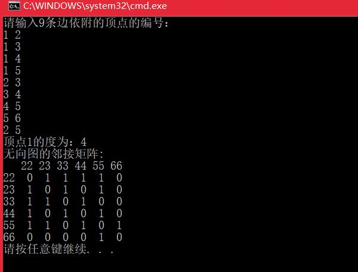
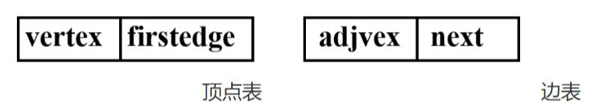
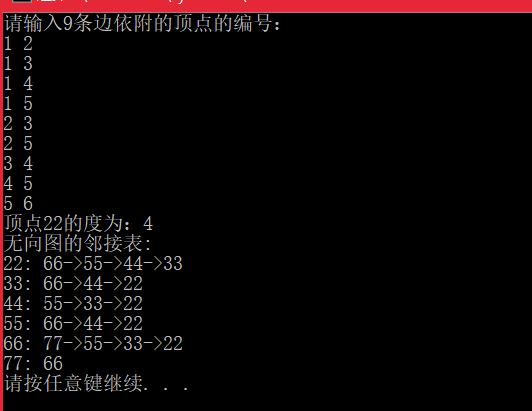
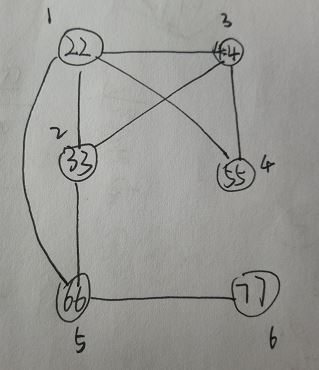
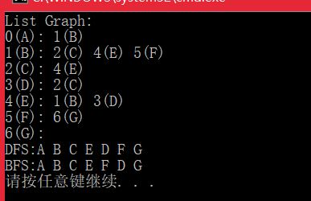
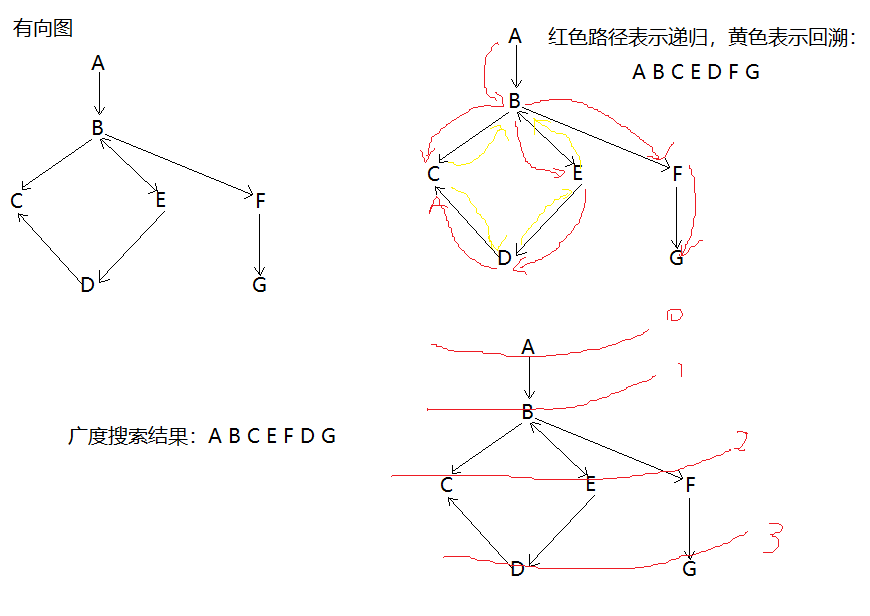

# <center>  Graph  </center>

---  
<font size=4>  

涉及图的算法有很多，也非常复杂，比如图的搜索、最短路径、最小生成树、二分图等等。下面将对图的存储和搜索进行学习总结。     
## 1.实现有向图、无向图、有权图、无权图的邻接矩阵和邻接表表示方法   
**1.1 图的相关概念：** 图是一种非常复杂的非线性表结构。 
>- 树中的元素被称为节点，图中的元素就叫做**顶点** 。  
>- 图中的一个定点可以与任意其他定点建立连接关系，把这种建立的关系叫做**边** 。   
>- 跟定点相连接的边的条数叫做定点的**度** 。  
>- 在有向图中，把度分为入度和出度。  
>- 在带权图中，每条边都有一个权重，我们可以通过这个权重来表示QQ好友间的亲密度。  

**1.2 无向图**  
**邻接矩阵实现，基本思想：** 用一个一维数组存储图中顶点的信息，用一个二维数组(称为邻接矩阵)存储图中各顶点之间的邻接关系。假设图G=(V,E)有n个顶点，则邻接矩阵是一个n×n的方阵。  
```

	#include <iostream>	
	using namespace std;
	
	//基于邻接矩阵存储的图的类实现
	const int MaxSize = 10;
	int visited[MaxSize] = { 0 };//定点是否被访问标记
	template<typename T>
	class MGraph{
	public:
		MGraph(T a[], int n, int e);//构造函数建立具有n个顶点e条边的图
		int degree(T val);//求顶点为val的度
		void printMatrix();
		void DFSTraverse(int v);//深度优先遍历图
	private:
		T vertex[MaxSize];//存放图中顶点的数组
		int arc[MaxSize][MaxSize];//存放图中边的数组 0表示不连通，1表示连通
		int vertexNum, arcNum;//图中顶点数和边数
	};

	template<typename T>
	void MGraph<T>::printMatrix()
	{
		cout << "无向图的邻接矩阵:\n   ";
		for (int i = 0; i < vertexNum; i++)
			cout << vertex[i] << ' ';
		cout << endl;
		for (int i = 0; i < vertexNum;i++)
		{
			cout << vertex[i] << "  ";
			for (int j=0;j<vertexNum;j++)
			{
				cout << arc[i][j] << "  ";
			}cout << endl;
		}
	}
	
	
	template<typename T>
	void MGraph<T>::DFSTraverse(int v)
	{
		cout << vertex[v] << " ";
		visited[v] = 1;
		for (int j = 0; j < vertexNum;j++)
		{
			if (arc[v][j] && visited[j] == 0)
				DFSTraverse(j);
		}
	}
	
	template<typename T>
	int MGraph<T>::degree(T val)
	{
		int i = 0;
		while (vertex[i++] != val);//找到顶点为val的位置
		if (i > vertexNum) return -1;
		i--;
		int res=0;//求第i行值为1的个数
		for (int j = 0; j < vertexNum; j++)
		{
			if (arc[i][j] == 1) res ++;
		}
		return res;
	}
	
	template<typename T>
	MGraph<T>::MGraph(T a[], int n, int e)
	{
		vertexNum = n;
		arcNum = e;
		for (int i = 0; i < vertexNum; i++)//顶点初始化
			vertex[i] = a[i];
		for (int i = 0; i < vertexNum; i++){
			for (int j = 0; j < vertexNum; j++)
				arc[i][j] = 0;
		}
		cout << "请输入" << e << "条边依附的顶点的编号：\n";//第i个顶点和第j个顶点
		for (int k = 0; k < e;k++)
		{
			int i, j;
			cin >> i >> j;
			arc[i-1][j-1] = 1;
			arc[j-1][i-1] = 1;
		}
	}
	
	
	int main(){
		int array[] = { 22, 23, 33, 44, 55, 66 };
		MGraph<int> graph(array, 6, 9);
		cout << "顶点1的度为：" << graph.degree(22) << endl;
		graph.printMatrix();
		return 0;
	}
```                                                                                                                                                                                                                                                                                                                                                                                                                                                                                                                                                                                                                                                                                          
  

**邻接表实现，基本思想：**  对于图的每个顶点vi，将所有邻接于vi的顶点连成一个单链表，称为顶点vi的边表(对于有向图则称为出边表)，所有边表的头指针和存储顶点信息的一维数组构成了顶点表。    
邻接表有两种节点结构，：顶点表节点和边表节点。  
  
其中，vertex：数据域，存放顶点信息；firstedge：指针域，指向边表中第一个节点；adjverx：邻接点域，边的终点在顶点表中的下标；next：指针域，指向边表中的下一个节点。  
```

	#include <iostream>
	
	using namespace std;
	struct ArcNode //边表顶点
	{
		int adjvex;
		struct ArcNode *next;
	};
	template<typename T>
	struct VertexNode{//顶点表
		T vertex;
		ArcNode *firstedge;
	};
	//基于邻接矩阵存储的图的类实现
	const int MaxSize = 10;
	//int visited[MaxSize] = { 0 };//定点是否被访问标记
	template<typename T>
	class ALGraph{
	public:
		ALGraph(T a[], int n, int e);//构造函数建立具有n个顶点e条边的图
		int degree(T val);//求顶点为val的度
		void printMatrix();
	private:
		VertexNode<T> adjlist[MaxSize];//存放图中顶点的数组
		int vertexNum, arcNum;//图中顶点数和边数
	};
	
	template<typename T>
	int ALGraph<T>::degree(T val)
	{
		int res = 0;
		int i = -1;
		while (adjlist[++i].vertex != val);//找到顶点值为val的位置
		if (i >= vertexNum) return res;
		ArcNode *p = adjlist[i].firstedge;//遍历顶点表的链长
		while(p)
		{
			res++;
			p = p->next;
		}
		return res;
	}
	
	template<typename T>
	void ALGraph<T>::printMatrix()
	{
		cout << "无向图的邻接表:\n";
		for (int i = 0; i < vertexNum;i++)
		{
			cout << adjlist[i].vertex << ": ";
			ArcNode *p = adjlist[i].firstedge;
			while (p)
			{
				cout << adjlist[p->adjvex].vertex;//将邻接表的顶点值打印出来
				p = p->next;
				if (p) cout << "->";
			}
			cout << endl;
		}
	}
	
	template<typename T>
	ALGraph<T>::ALGraph(T a[], int n, int e)
	{
		vertexNum = n;
		arcNum = e;
		for (int i = 0; i < vertexNum;i++)
		{
			adjlist[i].vertex = a[i];
			adjlist[i].firstedge = nullptr;
		}
		cout << "请输入" << e << "条边依附的顶点的编号：\n";//第i个顶点和第j个顶点
		for (int k = 0; k < arcNum;k++)
		{
			int i, j;
			cin >> i >> j;//i与j相连
			i--; j--;//顶点的编号比实际下标大1
			ArcNode *s = new ArcNode;//头插法
			s->adjvex = j;
			s->next = adjlist[i].firstedge;
			adjlist[i].firstedge = s;
			ArcNode *s2 = new ArcNode;//头插法
			s2->adjvex = i;
			s2->next = adjlist[j].firstedge;
			adjlist[j].firstedge = s2;
		}
	}
	
	
	int main(){
		int arry[] = { 22, 33, 44, 55, 66, 77 };
		ALGraph<int> graph(arry, 6, 9);
		cout << "顶点22的度为：" << graph.degree(22) << endl;
		graph.printMatrix();
	
		return 0;
	}
```
  
顶点关系如右图：

**1.3 有向图**  
创建有向图时，在输入边的信息时，需要输出从顶点i到顶点j的信息。  
**邻接矩阵：**  有向图和无向图在构造函数中有些许差别，如下  
```

	template<typename T>
	MGraph<T>::MGraph(T a[], int n, int e)
	{
		vertexNum = n;
		arcNum = e;
		for (int i = 0; i < vertexNum; i++)//顶点初始化
			vertex[i] = a[i];
		for (int i = 0; i < vertexNum; i++){
			for (int j = 0; j < vertexNum; j++)
				arc[i][j] = 0;
		}
		cout << "请输入" << e << "条边,并按此须输出依附的顶点的编号：\n";//第i个顶点和第j个顶点
		for (int k = 0; k < e; k++)
		{
			int i, j;
			cin >> i >> j;
			arc[i - 1][j - 1] = 1;
			//arc[j-1][i-1] = 1;该语句注释即可
		}
	}

```

**邻接表：**  改变构造函数中的部分代码即可  
```

	ALGraph<T>::ALGraph(T a[], int n, int e)
	{
		vertexNum = n;
		arcNum = e;
		for (int i = 0; i < vertexNum;i++)
		{
			adjlist[i].vertex = a[i];
			adjlist[i].firstedge = nullptr;
		}
		cout << "请输入" << e << "条边依附的顶点的编号：\n";//第i个顶点和第j个顶点
		for (int k = 0; k < arcNum;k++)
		{
			int i, j;
			cin >> i >> j;//i与j相连
			i--; j--;//顶点的编号比实际下标大1
			ArcNode *s = new ArcNode;//头插法
			s->adjvex = j;
			s->next = adjlist[i].firstedge;
			adjlist[i].firstedge = s;
			//ArcNode *s2 = new ArcNode;//头插法
			//s2->adjvex = i;
			//s2->next = adjlist[j].firstedge;
			//adjlist[j].firstedge = s2;
		}
	}
```

**1.4 无向有权图**  
**邻接矩阵** 和无向图的区别就是邻接矩阵中存放的不再是0和1，而是两顶点之间的权重
  
**邻接表** 在边表结构体中可以再加一个参数，表示该顶点与边表的权重  

**1.4 有向有权图**  
在构造函数上面与无向有权图却又差别，实现原理都是一样的。  


## 2.实现图的深度优先搜索、广度优先搜索  
以有向图为例，对两种搜索方法进行说明。  
**2.1 深度优先搜索** 和树的先序遍历比较类似。假设初始状态是图中所有顶点均未被访问，则从某个顶点v出发，首先访问该顶点，然后依次从它的各个未被访问的邻接点出发深度优先搜索遍历图，直至图中所有和v有路径相通的顶点都被访问到。 若此时尚有其他顶点未被访问到，则另选一个未被访问的顶点作起始点，重复上述过程，直至图中所有顶点都被访问到为止。  
**2.2 广度优先搜索** 从图中某顶点v出发，在访问了v之后依次访问v的各个未曾访问过的邻接点，然后分别从这些邻接点出发依次访问它们的邻接点，并使得“先被访问的顶点的邻接点先于后被访问的顶点的邻接点被访问，直至图中所有已被访问的顶点的邻接点都被访问到。如果此时图中尚有顶点未被访问，则需要另选一个未曾被访问过的顶点作为新的起始点，重复上述过程，直至图中所有顶点都被访问到为止。换句话说，广度优先搜索遍历图的过程是以v为起点，由近至远，依次访问和v有路径相通且路径长度为1,2...的顶点。  
```

	#include <iostream>
	#include <vector>
	using namespace std;
	#define  MAX 100
	//邻接表 有向图
	class ListDG
	{
	private:
		struct ENode //邻接表中对应的链表的顶点
		{
			int ivex;//该边所指向的顶点的位置
			ENode *nextEdge;//指向下一条弧的指针
		};
		struct VNode //邻接表中表的顶点
		{
			char data;//顶点信息
			ENode *firstEdge;//指向第一条依附该点的弧
		};
	
		int VexNum;//图的顶点的数目
		int EdgeNum;//图的边的数目
		VNode Vexs[MAX];
	
	public:
		//创建邻接表对应的图（自己输入）
		ListDG();
		//创建邻接表对应的图（用已提供的数据）
		ListDG(char vexs[], int vlen, char edges[][2], int elen);
		~ListDG();
		void DFS();
		void BFS();//广度优先搜索，类似与树的层序遍历
		void print();//打印邻接表图
	private:
		//返回ch的位置
		int getPosition(char ch);
		//深度优先搜索辅助函数
		void DFS(int i, int visited[]);
	};
	
	ListDG::ListDG()
	{
		char c1,c2;
		int p1, p2;
		cout << "输入顶点数和边数：\n";
		cin >> VexNum >> EdgeNum;
		if (VexNum<1||EdgeNum<1||(EdgeNum>VexNum*(VexNum-1)))
		{
			cout << "input error:invalid parameters!\n";
			return;
		}
		//初始化邻接表的顶点
		for (int i = 0; i < VexNum;i++)
		{
			cout << "vertex(" << i << "):";
			cin >> Vexs[i].data;
			Vexs[i].firstEdge = nullptr;
		}
		//初始化邻接表的边
		for (int i = 0; i < EdgeNum;i++)
		{
			//读取边的起始顶点和结束顶点
			cout << "edge(" << i << "):";
			cin >> c1 >> c2;
			p1 = getPosition(c1);
			p2 = getPosition(c2);
			ENode *node = new ENode;
			node->ivex = p2;
			node->nextEdge = nullptr;
			//将node链接到p1所在链表的末尾，尾插
			if (Vexs[p1].firstEdge == nullptr)
				Vexs[p1].firstEdge = node;
			else{
				ENode *t = Vexs[p1].firstEdge;
				while (t->nextEdge)			
					t = t->nextEdge;			
				t->nextEdge = node;
			}
		}
	}
	
	ListDG::ListDG(char vexs[], int vlen, char edges[][2], int elen)
	{
		char c1, c2;
		int p1, p2;
		VexNum = vlen;
		EdgeNum = elen;
		for (int i = 0; i < VexNum;i++)
		{
			Vexs[i].data = vexs[i];
			Vexs[i].firstEdge = nullptr;
		}
		for (int i = 0; i < EdgeNum;i++)
		{
			//读取边的起始节点和结束节点
			c1 = edges[i][0];
			c2 = edges[i][1];
			p1 = getPosition(c1);
			p2 = getPosition(c2);
			ENode *node = new ENode;
			node->ivex = p2;
			node->nextEdge = nullptr;
			if (Vexs[p1].firstEdge == nullptr)
				Vexs[p1].firstEdge = node;
			else{
				ENode *t = Vexs[p1].firstEdge;
				while (t->nextEdge)
					t = t->nextEdge;
				t->nextEdge = node;
			}
		}
	}
	
	ListDG::~ListDG()
	{
	}
	
	int ListDG::getPosition(char ch)
	{
		for (int i = 0; i < VexNum;i++)
		{
			if (Vexs[i].data == ch)
				return i;
		}
		return -1;
	}
	
	void ListDG::DFS()
	{
		int visited[MAX] = { 0 };//顶点访问标记
		cout << "DFS:";
		for (int i = 0; i < VexNum;i++)
		{
			if (!visited[i])
				DFS(i, visited);
		}
		cout << endl;
	}
	
	void ListDG::DFS(int i, int visited[])
	{
		visited[i] = 1;
		cout << Vexs[i].data << " ";
		ENode *node = Vexs[i].firstEdge;
		while (node)
		{
			if (!visited[node->ivex])
				DFS(node->ivex, visited);
			node = node->nextEdge;
		}
	}
	
	void ListDG::BFS()
	{
		int head=0, rear = 0;
		int queue[MAX];//辅助队列
		int visited[MAX] = { 0 };//顶点访问标记
		int j, k;
		ENode *node;
		cout << "BFS:";
		for (int i = 0; i < VexNum;i++)
		{
			if (!visited[i])
			{
				visited[i] = 1;
				cout << Vexs[i].data << " ";
				queue[rear++] = i;//入队列
			}
			while (head!=rear)
			{
				j = queue[head++];//出队列
				node = Vexs[j].firstEdge;
				while (node)
				{
					k = node->ivex;
					if (!visited[k])
					{
						visited[k] = 1;
						cout << Vexs[k].data << " ";
						queue[rear++] = k;
					}
					node = node->nextEdge;
				}
			}
		}cout << endl;
	}
	
	void ListDG::print()
	{
		ENode *node;
		cout << "List Graph:\n";
		for (int i = 0; i < VexNum; i++)
		{
			cout << i << "(" << Vexs[i].data << "): ";
			node = Vexs[i].firstEdge;
			while (node)
			{
				cout << node->ivex << "(" << Vexs[node->ivex].data << ") ";
				node = node->nextEdge;
			}
			cout << endl;
		}
	}
	
	
	int main(){
		char vexs[] = { 'A', 'B', 'C', 'D', 'E', 'F', 'G' };
		char edges[][2] = { { 'A', 'B' }, { 'B', 'C' }, { 'B', 'E' }, { 'B', 'F' }, { 'C', 'E' },
		{ 'D', 'C' }, { 'E', 'B' }, { 'E', 'D' }, { 'F', 'G' }, };
		int vlen = sizeof(vexs) / sizeof(vexs[0]);
		int elen = sizeof(edges) / sizeof(edges[0]);
		ListDG *pG;
		pG = new ListDG(vexs, vlen, edges, elen);
		pG->print();//打印图
		pG->DFS();
		pG->BFS();
	
		return 0;
	}
```
  
以下是上述例子中输入的图：


</front>