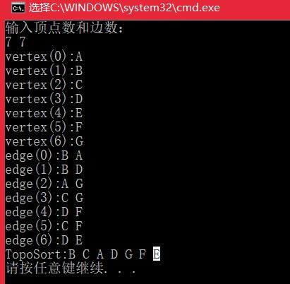

# <center>  拓扑排序  </center>

---  
<font size=4>  

**拓扑排序介绍：**  是指将一个有向无环图(Directed Acyclic Graph简称DAG),进行排序进而得到一个有序的线性序列。  
例如，一个项目包括A、B、C、D四个子部分来完成，并且A依赖于B和D，C依赖于D。现要制定一个计划，写出A、B、C、D的执行顺序。这时就可以用拓扑排序，他就是用来确定事物发生的顺序的。  
在拓扑排序中，如果存在一条从顶点A到顶点B的路径，那么在排序结果中B出现在A的后面。  

## 1.Kahn算法   
**问题分析：** 拓扑排序的基本步骤如下：  
>- 构造一个队列Q(queue)和拓扑排序的结果队列T(topological);  
>- 把所有没有依赖顶点的节点放入Q；  
>- 当Q还有顶点的时候执行下面步骤：  
>>- 从Q中取出一个顶点n(将n从Q中删掉)，并放入T(将n加入到结果集中)；  
>>- 对n中的每一个邻接点m(n是起点，m是终点);  
>>>- 去掉边<n,m>;
>>>- 如果m没有依赖顶点，则把m放入Q；  
>
>注：顶点A没有依赖点，是指不存在以A为终点的边。  

```

	/*
	**返回值：
	** -1 失败（由于内存不足等原因造成的）
	** 0 成功排序并输出结果
	** 1 失败（该有向图是忧环的）
	*/
	int ListDG::topologicalSort()
	{
		int head = 0, rear = 0;//辅助队列的头和尾
		int *queue = new int[VexNum];//辅助队列
		int *ins = new int[VexNum];//入度数组
		char *tops = new char[VexNum];//拓扑排序结果数组，记录每个节点的排序后的序号
		ENode *node;
		memset(queue, 0, VexNum*sizeof(int));
		memset(ins, 0, VexNum*sizeof(int));
		memset(tops, 0, VexNum*sizeof(char));
		int j, index = 0;
		//统计每个顶点的入度数
		for (int i = 0; i < VexNum;i++)
		{
			node = Vexs[i].firstEdge;
			while (node)
			{
				ins[node->ivex]++;
				node = node->nextEdge;
			}
		}
		//将所有入度为0的顶点入队列
		for (int i = 0; i < VexNum;i++)
		{
			if (ins[i] == 0)
				queue[rear++] = i;
		}
		while (head!=rear)//队列非空
		{
			//cout << "head=" << head << " rear=" << rear << endl;
			j = queue[head++];//出队
			tops[index++] = Vexs[j].data;//将该顶点添加到tops中，tops是排序结果
			node = Vexs[j].firstEdge;//获取以该节点为起点的出边队列
			//将与node关联的节点的入度减1
			//若减1之后，该节点的入度为0；则将该节点添加到队列中
		//	cout << "j="<<j<<": ";
			while (node!=nullptr)
			{
				//cout << ins[node->ivex] << "前,";
				ins[node->ivex]--;
				//cout << ins[node->ivex] << "后,";
				if (ins[node->ivex] == 0)
					queue[rear++] = node->ivex;
				node = node->nextEdge;
			}
			//cout << endl;
		}
		//cout << "index=" << index <<"VexNum="<<VexNum<< endl;
		if (index!=VexNum)
		{
			cout << "Graph has a cycle\n";
			delete queue;
			delete ins;
			delete tops;
			return 1;
		}
		//打印拓扑排序结果
		cout << "TopoSort:";
		for (int i = 0; i < VexNum; i++)
		{
			cout << tops[i] << " ";
		}cout << endl;
		delete queue;
		delete ins;
		delete tops;
		return 0;
	}
	int main(){
		ListDG *pG2;
		pG2 = new ListDG();
		pG2->topologicalSort();
		return 0;
	}
```



## 2.DFS算法    
**看了这么多，脑子已经不够用了，这题先放一放** 

</front>