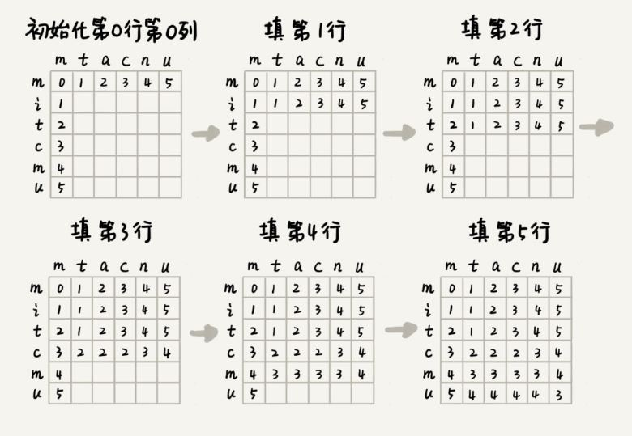

# <center>  动态规划  </center>

---  
<font size=4>  

## 1.最小路径和  [Minimum Path Sum](https://leetcode.com/problems/minimum-path-sum/)   
**解题思路：**  维护一个二维的dp数组，其中dp[i][j]表示当前位置的最小路径和，递推式为dp[i][j]=grid[i][j]+min(dp[i-1][j],dp[i][j-1]). 
```

	class Solution {
	public:
	    int minPathSum(vector<vector<int>>& grid) {
	        int m=grid.size(),n=grid[0].size();
	        int dp[m][n]={grid[0][0]};
	        for(int i=1;i<m;i++)//初始化第一列
	            dp[i][0]=grid[i][0]+dp[i-1][0];
	        for(int j=1;j<n;j++)//初始化第一行
	            dp[0][j]=grid[0][j]+dp[0][j-1];
	        for(int i=1;i<m;i++){
	            for(int j=1;j<n;j++){
	                dp[i][j]=grid[i][j]+min(dp[i][j-1],dp[i-1][j]);
	            }
	        }
	        return dp[m-1][n-1];
	    }
	};
```

## 2.编程实现莱文斯坦最短编辑距离(Levenshtein distance)    
**(1)编辑距离：**  是指将一个字符串转化为另一个字符串，需要的最小编辑操作次数(比如增加一个字符、删除一个字符、替换一个字符)。编辑距离越大，说明两个字符串的相似程度越小，；反之编辑距离越小，说明两个字符串的相似程度越大；对于两个完全相同的字符串来说，编辑距离就是0。   
**(2)问题分析：**  求把一个字符串变成另一个字符串，需要的最小编辑次数。整个求解过程，涉及多个决策阶段，我们需要依次考察一个字符串中的每个字符，跟另一个字符串中的字符是否匹配，匹配的话如何处理，不匹配的化如何处理。所以，这个问题符合**多阶段决策最优解模型。**      
**(3)回溯处理:**  先用回溯算法,来解决.回溯是一个嘀咕处理的过程.如果a[i]和b[j]匹配,我们递归考察a[i+1]和b[i+1];如果a[i]和b[j]不匹配,那我们有多种处理方式可选: 
 
- 可以删除a[i],然后递归考察a[i+1] b[j];  
- 可以删除b[j],然后递归考察a[i] b[j+1];  
- 可以在a[i]前面添加一个和b[j]相同的字符,然后递归考察a[i+1] b[j];  
- 可以在b[j]前面添加一个和a[i]相同的字符,然后递归考察a[i] b[j+1];  
- 可以将a[i]替换成b[j],或者将b[j]替换成a[i],然后递归考察a[i+1] b[j+1].   
 
```

	#include <iostream>
	#include <string>
	using namespace std;
	//编辑距离——回溯算法实现
	string a = "mitcmu";
	string b = "mtacnu";
	int m = 6, n = 6;//分别为字符串a和b的长度
	int minDist = INT_MAX;
	void lwstBT(int i, int j, int edist){
		if (i==n||j==m)
		{
			if (i < n) edist += (n - i);
			if (j < m) edist += (m - j);
			if (edist < minDist) minDist = edist;
			return;
		}
		if (a[i] == b[j])//两个字符串匹配
			lwstBT(i + 1, j + 1, edist);
		else{
			lwstBT(i + 1, j, edist + 1);//删除a[i]或者b[j]前添加一个字符
			lwstBT(i , j+1 , edist + 1);//删除b[j]或a[i]前添加一个字符
			lwstBT(i + 1, j + 1, edist + 1);//将a[i]和b[j]替换为相同字符
		}
	
	}
	int main(){
		lwstBT(0,0,0);
		cout << minDist;//result:3
		return 0;
	}
```

**(4)动态规划:**  上述回溯算法(i,j,edist)中,edist表示处理到a[i]和b[j]时,已经执行的编辑操作的次数.使用动态规划(i,j,min_edist),min_edist表示处理到a[i]和b[j]时,已经执行的最少编辑次数.而状态(i,j)可能从(i-1,j),(i,j-1),(i-1,j-1)三个状态中的任意一个转移过来.  
>如果:a[i]!=b[j],那么min_edist(i,j)=min(min_edist(i-1,j)+1, min_edist(i,j-1)+1,min_edist(i-1,j-1)+1);  
>如果:a[i]==b[j],那么min_edist(i,j)=min(min_edist(i-1,j)+1, min_edist(i,j-1)+1,min_edist(i-1,j-1)).  

  

```

	int minDist = INT_MAX;
	int min(int x, int y, int z){
		int res = INT_MAX;
		if (x < res) res = x;
		if (y < res) res = y;
		if (z < res) res = z;
		return res;
	}
	int lwstDP(string &a,int n,string &b,int m ){
		//int **minDist = new int[n][m];//直接这样写会报编译错误，C++不允许直接用变量做维数声明，必须用常量
		int **minDist = new int*[n];
		for (int i = 0; i < n; i++)
			minDist[i] = new int[m];//分别给int*类型的数组申请空间，即一维数组的动态申请
		for (int j = 0; j < m;j++)//初始化第0行：a[0...o]与b[0...j]的编辑距离
		{
			if (a[0] == b[j]) minDist[0][j] = j;
			else if (j != 0) minDist[0][j] = minDist[0][j - 1]+1;
			else
				minDist[0][j] = 1;
		}
		for (int i = 0; i < n;i++)//初始化第0列：a[0...i]与b[0...0]的编辑距离
		{
			if (a[i] == b[0]) minDist[i][0] = i;
			else if (i != 0) minDist[i][0] = minDist[i - 1][0]+1;
			else minDist[i][0] = 1;
		}
		
		for (int i = 1; i < n;i++)
		{
			for (int j = 1; j < m;j++)
			{
				if (a[i] == b[j])
					minDist[i][j] = min(minDist[i - 1][j]+1, minDist[i][j - 1]+1, minDist[i - 1][j - 1]);
				else
					minDist[i][j] = min(minDist[i - 1][j] + 1, minDist[i][j - 1] + 1, minDist[i - 1][j - 1]+1);
			}
		}
		return minDist[n - 1][m - 1];
	}
	
	int main(){
		string a = "mitcmu";
		string b = "mtacnu";
		int n = 6, m = 6;//分别为字符串a和b的长度
		cout << lwstDP(a, 6, b, 6);//result:3
	
		return 0;
	}
```

## 3.编程实现查找两个字符串的最长公共子序列(如果是子串的化就要求子序列在目串中连续出现)   

**问题分析：**  最长公共子串作为编辑距离中的一种，只允许增加、删除字符两种编辑操作，本质上它表征的也是两个字符串之间的相似程度。最长公共子串的大小，表示两个字符串相似程度的大小。  
**解题思路：**  定义状态，每个状态包括三个变量(i,j,max_lcs)，max_lcs表示a[0...i]和b[i...j]的最长公共子串长度。先来看回溯的处理思路，我们从a[0]和b[0]开始，依次考察两个字符串中的字符是否匹配。  

- 如果a[i]与b[j]匹配，将最大公共字串长度加1，并继续考察a[i+1]和b[j+1];  
- 如果a[i]与b[j]不匹配，最长公共子串长度不变，这时有两个不同的决策路线：  

>- 删除a[i],或者在b[j]前面加上一个字符a[i],然后继续考察a[i+1]和b[j];  
>- 删除b[j],或者在a[i]前面加上一个字符b[j],然后继续考察a[i]和b[j+1]。  

也就是说，如果我们要求a[0...i]和b[0...j]的最长公共长度max_lcs(i,j),只能从下面三个状态转移过来：  

>- (i-1,j-1,max_lcs),其中max_lcs表示a[[0...i-1]和b[0...j-1]的最长公共子串长度;  
>- (i-1,j,max_lcs),其中max_lcs表示a[[0...i-1]和b[0...j]的最长公共子串长度;  
>- (i,j-1,max_lcs), 其中max_lcs表示a[[0...i]和b[0...j-1]的最长公共子串长度。  
```

	int max(int x, int y, int z){
		int res = INT_MIN;
		if (x > res) res = x;
		if (y > res) res = y;
		if (z > res) res = z;
		return res;
	}
	int lcsDP(string &a, int n, string &b, int m){
		int **maxlcs = new int*[n];
		for (int i = 0; i < n; i++)
			maxlcs[i] = new int[m];
		for (int j = 0; j < m;j++)//初始化第0行：a[0...0]和b[0...j]的maxlcs
		{
			if (a[0] == b[j]) maxlcs[0][j] = 1;
			else if (j!=0) maxlcs[0][j] = maxlcs[0][j - 1];
			else maxlcs[0][j] = 0;
		}
		for (int i = 0; i < n;i++)//初始化第0列：a[0...i]和b[0...0]的mxlca
		{
			if (a[i] == b[0]) maxlcs[i][0] = 1;
			else if (i != 0) maxlcs[i][0] = maxlcs[i - 1][0];
			else maxlcs[i][0] = 0;
		}
		for (int i = 1; i < n;i++)
		{
			for (int j = 1; j < m;j++)
			{
				if (a[i] == b[j]) maxlcs[i][j] = max(maxlcs[i - 1][j], maxlcs[i][j - 1], maxlcs[i - 1][j - 1] + 1);
				else maxlcs[i][j] = max(maxlcs[i - 1][j], maxlcs[i][j - 1], maxlcs[i - 1][j - 1]);
			}
		}
		return maxlcs[n - 1][m - 1];
	}
	int main(){
		string s1 = "abcbdab";
		string s2 = "bdcaba";
		cout<<lcsDP(s1, 7, s2, 6);//result:4
		return 0;
	}
```

## 4.编程实现一个数据序列的最长递增子序列  
**解题思路：** 维护一个一维dp数组，其中dp[i]表示以nums[i]为结尾的最长递增子串的长度，对于每一个nums[i]，我们从第一个数再搜索到i，如果发现某个数小于nums[i]，我们更新dp[i]，dp[i]=max(dp[i],dp[j]+1),即比较当前dp[i]的值和那个小于nums[i]的数的dp值加1的大小，这样就不断更新dp数组，到最后dp数组中最大的值就是我们要返回的LIS的长度：  
```

	int LISDP(vector<int> &nums){
		vector<int> dp(nums.size(), 1);
		int res=0;
		for (int i = 0; i < nums.size();i++)
		{
			for (int j = 0; j < i;j++)
			{
				if (nums[j] < nums[i])
					dp[i] = max(dp[i], dp[j] + 1);
			}
			res = max(res, dp[i]);
		}
		return res;
	}
	int main(){
	
		vector<int> nums = { 10, 9, 2, 5, 3, 7, 101, 18 };
		cout << LISDP(nums);//result:4
	
		return 0;
	}
```


</front>